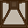
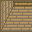
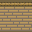
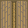
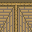
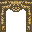
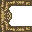
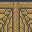
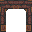

# Guide to Construction

Construction requires basic knowledge in other areas, such as resource acquirement, which are covered in the **[Guide to Crafting](Guide_to_Crafting)**.

It is truly a marvel, that from this dusty dirt under our feet, these
heaps of rugged stones and those chaotically growing trees could spring
such smooth, even walls in all their rectangular glory. A natural
landscape is a wild beast that needs to be reined in, and reined in it
will be!

There are a few key elements in the area of construction that you could
combine and rearrange as you see fit to raise buildings, lay roads and
develop infrastructure as a whole that is both functional and pleasing
to the eye. These elements are walls, floors, doors, windows, roofs and
barricades along with fences. There are also somewhat distinct
categories of fortifications and lighting.

**To look for specific items, use the “Find in page” command - Ctrl-F.**

## Construction orientation

**Mind that the orientation of some constructions depends on the
direction your character is facing!** For example, some walls are built
vertically if you are facing North or South, or horizontally, if you are
facing East or West. Some wall types also have separate corner elements
for better appearance. All of this is marked in the description of a
specific construction. **N, S, W, E** mean you need to be facing either
North, South, West and East to build a wall the same as the image;
**All** means the construction will look the same regardless of the
direction.

<b>Some wall tiles change their appearance depending on neighbouring
walls of the same type, so they connect seamlessly to each other.</b>
These walls are marked as **Adaptive**.

## Construction materials

A few more details about particular materials.

### Clay

**[Clay](Full_Crafting_List#clay)** is obtained from **[dirt](Guide_to_Crafting#soil)**:

- Dig any dirt tiles with a shovel to get dirt piles.

- Fill a container (a bucket, a barrel etc.) with water, then click dirt piles with it.

- 10 units of water + 1 dirt pile = 1 clay

### Bricks

Most bricks and blocks are made with **[Clay](Full_Crafting_List#clay)**, except for stone bricks.

  - First, make batches of unfired bricks.

  - Put the unfired bricks in either **[a campfire, an oven or a stove](Guide_to_Crafting#campfire-iron-oven-and-wood-stove)**.

  - Cook until done.

**Hover the mouse cursor over the icon to see the material cost.**

<table>
<tbody>
<tr>
<td>&ensp;<b>Clay blocks</b></td>
</tr>
<tr>
<td>&ensp;<b>Clay bricks</b></td>
</tr>
<tr>
<td>&ensp;<b>Cement bricks</b></td>
</tr>
<tr>
<td>&ensp;<b>Stone bricks</b></td>
</tr>
</tbody>
</table>

## Walls

<b>Deconstruction</b>

Any kind of wood walls could be set on fire by hitting them with a
torch. A wall will burn down in a few minutes, destroying the roof tiles
supported by the wall as well (more in the
**[Roofs](#roofs "wikilink")** section). **Remove the grass and the wood floor around the wall if you are going to burn it!** Otherwise the fire
will very likely spread from the burning wall.

Another way is simple brute force - hit a wall with melee weapons, and
it will go down sooner or later. Stone walls, the strongest ones, take
around 100 hits to bring down, or fewer if your strength is high and you
apply a weapon with high damage.

<u><b>Straw</b></u>

Made with 4 wood logs. Very primitive, but it still provides shelter, if
a flimsy one.

<table>
<tbody>
<tr>
<td>
<b>All</b></td>
</tr>
</tbody>
</table>

<u><b>Log</b></u>

Made with 6 wood logs. A sturdy wall, if slightly crude. Corner is the
same for all directions.

<table>
<tbody>
<tr>
<td>
<b>N, S</b>&emsp;
<b>W, E</b>&emsp;
<b>Corner</b></td>
</tr>
</tbody>
</table>

<u><b>Wood</b></u>

Made with 7 wood logs. Being out of planks, this wall is more refined
than the log one.

<table>
<tbody>
<tr>
<td>&emsp;
&emsp;
&emsp;
&emsp;
&emsp;
</td>
</tr>
<tr>
<td><b>Adaptive</b></td>
</tr>
</tbody>
</table>

<u><b>Wall frame</b></u>

Made with 1 wood log. Used as a base to build various walls, windows,
doors and doorways, such as medieval and shoji. More details below.

<table>
<tbody>
<tr>
<td>
<b>All</b></td>
</tr>
</tbody>
</table>

<u><b>Bamboo wall frame</b></u>

Made with 1 bamboo. Used as a base to build various walls, windows,
doors and doorways, such as bamboo and oriental. More details below.

<table>
<tbody>
<tr>
<td>
<b>All</b></td>
</tr>
</tbody>
</table>

<u><b>Medieval</b></u>

Made with 6 wood logs. A timber frame wall that comes in several
designs. To build, construct a wall frame first, then click it with wood
logs and choose a design.

<table>
<tbody>
<tr>
<td>&emsp;
&emsp;
&emsp;
</td>
</tr>
<tr>
<td><b>All</b></td>
</tr>
</tbody>
</table>

<u><b>Shoji</b></u>

Made with 1 paper sheet. A light paper wall, hailing from Japan. Divider
is meant for the interior of a building (this is important.) To build,
construct a wall frame first, then click it with a paper sheet.

<table>
<tbody>
<tr>
<td>
<b>Wall</b>&emsp;

<b>Divider</b></td>
</tr>
<tr>
<td><b>All</b></td>
</tr>
</tbody>
</table>

<u><b>Bamboo</b></u>

Made with bamboo: wall - 3 bundles, doorway - 2. Fits in nicely with the
jungle surroundings. To build, construct a bamboo wall frame first, then click
it with bamboo bundles.

<table>
<tbody>
<tr>
<td>
<b>Wall</b>&emsp;

<b>Doorway</b></td>
</tr>
<tr>
<td><b>All</b></td>
</tr>
</tbody>
</table>

<u><b>Oriental</b></u>

Made with 6 wood logs. To build, construct a bamboo wall frame first, then click it with wood
logs and choose a design.

<table>
<tbody>
<tr>
<td>
<b>Regular</b></td>
<td>
<b>Braced</b></td>
<td>
<b>Two panelled</b></td>
<td>
<b>Two panelled braced</b></td>
<td>
<b>Three panelled</b></td>
<td>
<b>Three panelled braced</b></td>
<td>
<b>Doorway</b></td>
</tr>
<tr>
<td colspan="7"><b>All</b></td>
</tr>
</tbody>
</table>

<u><b>Aztec</b></u>

Made with 8 wood logs. Useful for creating your very own altepetl.

<table>
<tbody>
<tr>
<td>&emsp;
&emsp;
&emsp;
&emsp;
&emsp;
&emsp;
&emsp;
</td>
</tr>
<tr>
<td><b>Adaptive</b></td>
</tr>
</tbody>
</table>

<u><b>Mayan</b></u>

Made with 6 stones.

<table>
<tbody>
<tr>
<td>&emsp;
&emsp;
&emsp;
&emsp;
&emsp;
&emsp;
&emsp;
</td>
</tr>
<tr>
<td><b>Adaptive</b></td>
</tr>
</tbody>
</table>

<u><b>Egyptian</b></u>

Made with 6 sandstones.

For the archway, directions N and W are also available (icons will be
mirrored accordingly.)

<table>
<tbody>
<tr>
<td width="40%">&emsp;
&emsp;
&emsp;
&emsp;
&emsp;
&emsp;</td>
<td>&emsp;
</td>
</tr>
<tr>
<td><b>Adaptive</b></td>
<td><b>S</b>&emsp;&emsp;&emsp;<b>E</b></td>
</tr>
</tbody>
</table>

<u><b>Nordic</b></u>

Made with 8 wood logs. For all your Långhus and mead hall needs.

<table>
<tbody>
<tr>
<td>&emsp;
&emsp;
&emsp;
&emsp;
&emsp;
</td>
</tr>
<tr>
<td><b>Adaptive</b></td>
</tr>
</tbody>
</table>

<u><b>Roman</b></u>

Made with 8 stones. Opus caementicium usque in sempiternum.

<table>
<tbody>
<tr>
<td>&emsp;
&emsp;
&emsp;
&emsp;
&emsp;
</td>
</tr>
<tr>
<td><b>Adaptive</b></td>
</tr>
</tbody>
</table>

<u><b>Dirt block</b></u>

A slightly dull, yet fairly useful material. Take a pile of dirt in your
hand and click it, or press Ctrl-Z or Z in the hotkeys mode. This will
start building a wall where you stand. Add 3 more piles to finish.

<table>
<tbody>
<tr>
<td>
<b>All</b></td>
</tr>
</tbody>
</table>

<u><b>Snow block</b></u>

Perfect for igloos. Take a pile of snow in your hand and click it, or
press Ctrl-Z or Z in the hotkeys mode. This will start building a wall
where you stand. Add 3 more piles to finish.

<table>
<tbody>
<tr>
<td>
<b>All</b></td>
</tr>
</tbody>
</table>

<u><b>Clay block</b></u>

One step above the dirt blocks. Take 1 batch of clay blocks in your hand
and click it, or press Ctrl-Z or Z in the hotkeys mode. Select clay
blocks. This will start building a wall where you stand. Add 2 more
batches to finish.

<table>
<tbody>
<tr>
<td>
<b>Wall</b>&emsp;

<b>Doorway</b></td>
</tr>
<tr>
<td><b>All</b></td>
</tr>
</tbody>
</table>

<u><b>Red earth</b></u>

Made by applying 1 portion of generic stucco (made with 1.5 pieces of
clay) to a clay block wall. Click the wall with the stucco, then select
the design.

The doorway is made by applying generic stucco to a clay block doorway.

<table>
<tbody>
<tr>
<td>
<b>Regular</b>&emsp;

<b>Pillared</b>&emsp;

<b>Smooth</b>&emsp;

<b>Doorway</b></td>
</tr>
</tbody>
</table>

<u><b>Sumerian</b></u>

Stylish architecture, dating thousands of years BC. Take 1 batch of clay
blocks in your hand and click it, or press Ctrl-Z or Z in the hotkeys
mode. Select Sumerian clay. This will start building a wall where you
stand. Add 2 more batches to finish. When finishing, you will be
prompted to choose a wall type, normal or corner, or to make it a
doorway. Corner could be chosen for 4 directions, NW, NE, SW, SE. The
image below is NW.

<table>
<tbody>
<tr>
<td>
<b>Wall</b>&emsp;

<b>Doorway</b>&emsp;

<b>Corner</b></td>
</tr>
<tr>
<td><b>All</b></td>
</tr>
</tbody>
</table>

<u><b>Sandstone</b></u>

Made with 8 sandstones.

<table>
<tbody>
<tr>
<td>
<b>Smooth</b></td>
</tr>
<tr>
<td><b>All</b></td>
</tr>
</tbody>
</table>

<u><b>Sandstone block</b></u>

Made with 8 sandstones. For the archway, directions N and W are also
available (icons will be mirrored accordingly.)

<table>
<tbody>
<tr>
<td width="30%">&emsp;
&emsp;
&emsp;
&emsp;
&emsp;
</td>
<td>&emsp;
</td>
</tr>
<tr>
<td><b>Adaptive</b></td>
<td><b>S</b>&emsp;&emsp;&emsp;<b>E</b></td>
</tr>
</tbody>
</table>

<u><b>Red sandstone block</b></u>

Made with 8 sandstones. For the archway, directions N and W are also
available (icons will be mirrored accordingly.)

<table>
<tbody>
<tr>
<td width="30%">&emsp;
&emsp;
&emsp;
&emsp;
&emsp;
</td>
<td>&emsp;
</td>
</tr>
<tr>
<td><b>Adaptive</b></td>
<td><b>S</b>&emsp;&emsp;&emsp;<b>E</b></td>
</tr>
</tbody>
</table>

<u><b>Sandstone fortress</b></u>

Made with 8 sandstones and 8 stones.

<table>
<tbody>
<tr>
<td>&emsp;
&emsp;
&emsp;
&emsp;
&emsp;
</td>
</tr>
<tr>
<td><b>Adaptive</b></td>
</tr>
</tbody>
</table>

<u><b>Stone</b></u>

Made with 8 stones. Use a chisel with a hammer to carve it into
different designs.

<table>
<tbody>
<tr>
<td>
<b>Regular</b>&emsp;

<b>Brick</b>&emsp;

<b>Cobbled</b>&emsp;

<b>Tiled</b></td>
</tr>
<tr>
<td><b>All</b></td>
</tr>
</tbody>
</table>

<u><b>Stone block</b></u>

Made with 8 stones. For the archway, directions N and W are also
available (icons will be mirrored accordingly.)

<table>
<tbody>
<tr>
<td width="30%">&emsp;
&emsp;
&emsp;
&emsp;
&emsp;
</td>
<td>&emsp;
</td>
</tr>
<tr>
<td><b>Adaptive</b></td>
<td><b>S</b>&emsp;&emsp;&emsp;<b>E</b></td>
</tr>
</tbody>
</table>

<u><b>Grecian</b></u>

Made by applying 1 portion of Greek stucco (made with 1.5 pieces of
clay) to a stone block wall. Click the wall with the stucco, then select
the design. Each design has a "bordered" option, which has a noticeable
outline. The pattern designs are also available in horizontal
orientation.

The archway is made by applying Greek stucco to a stone block archway.

<table>
<tbody>
<tr>
<td>
<b>Smooth</b></td>
<td>
<b>Cobbled</b></td>
<td>
<b>Pattern</b></td>
<td>
<b>Cob. pattern</b></td>
<td>
<b>Archway</b></td>
</tr>
<tr>
<td></td>
<td></td>
<td></td>
<td></td>
<td></td>
</tr>
<tr>
<td><b>Bordered</b></td>
<td></td>
<td></td>
<td></td>
<td></td>
</tr>
<tr>
<td><b>All</b></td>
<td></td>
<td></td>
<td></td>
<td></td>
</tr>
</tbody>
</table>

<u><b>Roman villa</b></u>

Made by applying 1 portion of Roman stucco (made with 1.5 pieces of
clay) to a stone block wall. Click the wall with the stucco, then select
the design.

<table>
<tbody>
<tr>
<td>
<b>Regular</b></td>
<td>
<b>Pillared</b></td>
<td>
<b>Relief</b></td>
<td>
<b>Hoplite rel.</b></td>
<td>
<b>Aquila rel.</b></td>
<td>
<b>Gladiator rel.</b></td>
</tr>
</tbody>
</table>

<u><b>Stone brick</b></u>

Made with 6 stone bricks, which are made from regular stone. For the
archway, directions N and W are also available (icons will be mirrored
accordingly.)

<table>
<tbody>
<tr>
<td width="30%">&emsp;
&emsp;
&emsp;
&emsp;
&emsp;
</td>
<td>&emsp;
</td>
</tr>
<tr>
<td><b>Adaptive</b></td>
<td><b>S</b>&emsp;&emsp;&emsp;<b>E</b></td>
</tr>
</tbody>
</table>

<u><b>Fortress</b></u>

Made with 8 stones. One of the strongest walls. For the archway,
directions N and W are also available (icons will be mirrored
accordingly.)

<table>
<tbody>
<tr>
<td width="30%">&emsp;
&emsp;
&emsp;
&emsp;
&emsp;
&emsp;</td>
<td>&emsp;
</td>
</tr>
<tr>
<td><b>Adaptive</b></td>
<td><b>S</b>&emsp;&emsp;&emsp;<b>E</b></td>
</tr>
</tbody>
</table>

<u><b>Marble</b></u>

Made with 8 marble.

<table>
<tbody>
<tr>
<td>
<b>Regular</b></td>
</tr>
<tr>
<td><b>All</b></td>
</tr>
</tbody>
</table>

<u><b>Marble block</b></u>

Made with 8 marble. For the archway,
directions N and W are also available (icons will be mirrored
accordingly.)

<table>
<tbody>
<tr>
<td width="30%">&emsp;
&emsp;
&emsp;
&emsp;
&emsp;
&emsp;</td>
<td>&emsp;
</td>
</tr>
<tr>
<td><b>Adaptive</b></td>
<td><b>S</b>&emsp;&emsp;&emsp;<b>E</b></td>
</tr>
</tbody>
</table>

<u><b>Grecian marble</b></u>

Made with 6 marble. For the archway,
directions N and W are also available (icons will be mirrored
accordingly.)

<table>
<tbody>
<tr>
<td width="30%">&emsp;
&emsp;
&emsp;
&emsp;
&emsp;
&emsp;</td>
<td>&emsp;
</td>
</tr>
<tr>
<td><b>Adaptive</b></td>
<td><b>S</b>&emsp;&emsp;&emsp;<b>E</b></td>
</tr>
</tbody>
</table>

<u><b>Clay brick</b></u>

An advanced construction material. Take 1 batch of clay bricks in your
hand and click it, or press Ctrl-Z or Z in the hotkeys mode. This will
start building a wall where you stand. Add 1 more batch to finish.

<table>
<tbody>
<tr>
<td>&emsp;
&emsp;
&emsp;
&emsp;
&emsp;
</td>
</tr>
<tr>
<td><b>Adaptive</b></td>
</tr>
</tbody>
</table>

<u><b>Cement</b></u>

A modern, no-frills, but very strong construction material. Take 1 batch
of cement bricks in your hand and click it, or press Ctrl-Z or Z in the
hotkeys mode. This will start building a wall where you stand. Add 1
more batch to finish.

<table>
<tbody>
<tr>
<td>&emsp;
&emsp;
&emsp;
&emsp;
&emsp;
</td>
</tr>
<tr>
<td><b>Adaptive</b></td>
</tr>
</tbody>
</table>

## Roofs

Roofs provide shelter from bad weather, e.g. rains, blizzards and
sandstorms, as well as a nice cool shade.

Roofs are supported by walls, wooden roof supports and stone pillars and
columns. ***Wooden mine supports do not hold the buildable roof!***

<table>
<tbody>
<tr>
<td>
<b>Roof support</b></td>
<td>
<b>Nordic roof support</b></td>
<td>
<b>Stone pillar</b></td>
<td>
<b>Concrete pillar</b></td>
<td>
<b>Ionic column</b></td>
</tr>
<tr>
<td>
<b>Solomonic column</b></td>
<td>
<b>Thick Solomonic column</b></td>
<td>
<b>Aztec column</b></td>
<td></td>
<td></td>
</tr>
</tbody>
</table>

The image below shows the roof area supported by either a roof support
(pillars and columns support the same area) or a wall (all walls support
the same area.)

There is a variety of roofs to build from different materials (see below - hover the mouse cursor over a roof builder's icon to see the cost and
the material). Roof icons are adaptive, similarly to some of the walls,
so they change their appearance, depending on the roof in neighbouring
tiles.

**To construct a roof, take a respective roof builder and either click
it in your hand, or press Ctrl-Z or Z in the hotkeys mode.** A roof tile
will be constructed in the tile in front of you, the one you are facing,
if there is a suitable support nearby.

**To deconstruct a roof, click it with the hammer.** Either stand
outside the roof, so you can see it, or hold Alt and click the tile with
the roof. An additional "Turf" tab will appear in the upper right corner - click the roof there with the hammer in the active hand.

**If roof supports are removed with the roof still present, the roof
will collapse! Collapsing roof may severely injure and even kill those
in the roofed area, or even standing next to it.**

<table>
<tbody>
<tr>
<td>1 bundle of palm leaves</td>
<td></td>
<td><b>Palm leaves roof builder</b></td>
<td></td>
<td><b>Palm leaves roof</b></td>
</tr><tr>
<td>1 bundle of leaves</td>
<td></td>
<td><b>Thatch roof builder</b></td>
<td></td>
<td><b>Thatch roof</b></td>
</tr><tr>
<td>1 wood</td>
<td></td>
<td><b>Roof builder</b></td>
<td></td>
<td><b>Wood roof</b></td>
</tr><tr>
<td>0.5 clay</td><td></td>
<td><b>Clay roofing</b></td>
<td></td>
<td><b>Clay roof</b></td>
</tr><tr>
<td>0.5 clay</td>
<td></td>
<td><b>Black clay roofing</b></td>
<td></td>
<td><b>Kerawa roof</b></td>
</tr><tr>
<td>1 sandstone</td>
<td></td>
<td><b>Sandstone roof builder</b></td>
<td></td>
<td><b>Sandstone roof</b></td>
</tr><tr>
<td>1 stone</td>
<td></td>
<td><b>Mayan roof builder</b></td>
<td></td>
<td><b>Mayan roof</b></td>
</tr><tr>
<td>0.75 clay</td><td></td>
<td><b>Concrete roof builder</b></td>
<td></td>
<td><b>Concrete roof</b></td>
</tr>
</tbody>
</table>

## Floors

No more sloshing or plodding through the mud and snow! Walk the
civilized way, swiftly and with resonant "top-top" footfalls! Not only
that - floors on the surface prevent digging upwards from the
underground. **Floors can be removed with the hammer.**

<table>
<tbody>
<tr>
<td width="5%"></td>
<td><b>Floor cover</b></td>
<td>Made with 2 wood logs. The simplest type of floor, consisting of a few planks fastened together. Could be placed over a trench to make a bridge, or over a hole in the floor or ground to cover it (the latter concerns a couple of the TDM maps.)</td>
</tr>
</tbody>
</table>

The floors below are essentially identical, save for the appearance,
with a special note being that the wood floor could be set on fire.
**Hover the mouse cursor over an image to see the cost and the material.**

<u><b>Bamboo floors</b></u>

<table>
<tbody>
<tr>
<td></td>
<td><b>Tatami horizontal</b></td>
<td></td>
<td><b>Tatami vertical</b></td>
<td></td>
<td><b>Tatami dark horizontal</b></td>
<td></td>
<td><b>Tatami dark vertical</b></td>
<td></td>
</tr>
</tbody>
</table>

<u><b>Wood floors</b></u>

<table>
<tbody>
<tr>
<td>&emsp;<b>Wood</b></td>
<td>&emsp;<b>Fancy wood</b></td>
<td>&emsp;<b>Thatch</b></td>
<td>&emsp;<b>Thatch split</b></td>
<td></td>
</tr>
</tbody>
</table>

<u><b>Stone floors</b></u>

<table>
<tbody>
<tr>
<td>&emsp;<b>Cobblestone</b></td>
<td>&emsp;<b>Stone brick</b></td>
<td>&emsp;<b>Roman road</b></td>
<td>&emsp;<b>Slate</b></td>
</tr>
<tr>
<td>&emsp;<b>Road</b></td>
</tr>
</tbody>
</table>

<u><b>Marble floors</b></u>

Raw marble and marble tiles (except for ornate and grid tiles) floors
each have a few versions that have a slightly different look, which are
randomly selected upon construction.

<table>
<tbody>
<tr>
<td></td><td>
<b>Raw marble</b></td>
<td></td><td>
<b>Raw black marble</b></td>
<td></td><td>
<b>Raw pink marble</b></td>
<td></td><td>
<b>Marble</b></td>
</tr>
<tr>
<td></td><td>
<b>Marble tiles</b></td>
<td></td><td>
<b>Black marble tiles</b></td>
<td></td><td>
<b>Pink marble tiles</b></td>
<td></td><td>
<b>Ornate marble tile</b></td>
</tr>
<tr>
<td></td><td>
<b>Ornate black marble tile</b></td>
<td></td><td>
<b>Decorative marble tile</b></td>
<td></td><td>
<b>Decorative black marble tile</b></td>
<td></td><td>
<b>Decorative pink marble tile</b></td>
</tr>
<tr>
<td></td><td>
<b>Marble grid tile</b></td>
<td></td><td>
<b>Marble checkerboard</b></td>
<td></td><td>
<b>Reverse marble checkerboard</b></td>
<td></td><td>
<b>Pink marble checkerboard</b></td>
</tr>
<tr>
<td></td><td>
<b>Reverse pink marble checkerboard</b></td>
</tr>
</tbody>
</table>

<u><b>Sandstone floors</b></u>

<table>
<tbody>
<tr>
<td></td><td>
<b>Sandstone</b></td>
<td></td><td>
<b>Brick</b></td>
<td></td><td>
<b>Slab</b></td>
<td></td><td>
<b>Red slab</b></td>
</tr>
<tr>
<td></td><td>
<b>Tile</b></td>
<td></td><td>
<b>Decorative tile</b></td>
<td></td><td>
<b>Red decorative tile</b></td>
</tr>
</tbody>
</table>

<u><b>Clay floors</b></u>

<table>
<tbody>
<tr>
<td>&emsp;<b>Concrete</b></td>
</tr>
</tbody>
</table>

<u><b>Steel floors</b></u>

<table>
<tbody>
<tr>
<td>&emsp;
<b>Steel</b>&emsp;&emsp;
&emsp;
<b>Steel white</b></td>
</tr>
</tbody>
</table>

<u><b>Stairs</b></u>

At the moment, craftable stairs are purely cosmetic and cannot be used
to travel between different Z levels. Nevertheless, they still could be
used to create an impression of height difference.

<table>
<tbody>
<tr>
<td>&emsp;
<b>Stone</b></td>
<td>&emsp;
<b>Sandstone</b></td>
<td>&emsp;
<b>Wood</b></td>
</tr>
</tbody>
</table>

Stairs on the images are built while facing **S**; directions **N, W, E** are also available. Hover the mouse cursor over the images to see
the cost and the material.

## Doors

**Hover the mouse cursor over the images to see the cost, the material and
the direction (how it looks when built while facing either N, S, W or E.
"All" means a door always looks the same.)**

Only the doors marked as "locked" in the crafting menu could be locked
with a key (the iron and jail doors currently) - more details below.

<table>
<tbody>
<tr>
<td></td><td>
<b>Primitive fence door</b></td>
<td></td><td>
<b>Picket wood fence door</b></td>
<td></td><td>
<b>Rustic door</b></td>
<td></td><td>
<b>Wood door</b></td>
</tr>
<tr>
<td></td><td>
<b>Nordic door</b></td>
<td></td><td>
<b>Aztec door</b></td>
<td></td><td>
<b>Shoji door</b></td>
<td></td><td>
<b>Roman door</b></td>
</tr>
<tr>
<td></td><td>
<b>Iron door</b></td>
<td></td><td>
<b>Iron door</b></td>
<td></td><td>
<b>Wood jail door</b></td>
<td></td><td>
<b>Steel jail door</b></td>
</tr>
</tbody>
</table>

<table>
<tbody>
<tr>
<td> </td><td>
<b>Key and keychain</b></td>
<td>Key and keychain are made with iron ingots. Keys are used to lock certain doors, wooden cabinets, crates, lockers and large barrels - click them with the key.
<ul>
<li>To construct a lockable door, first make a key.</li>
<li>Enter the combination for the key, which is, basically, a password.</li>
<li>Hold the key in the non-active hand, then build a locked door with the iron in the active hand.</li>
<li>Now the door is tied to the key and could be opened and closed with it.</li>
<li>You can make more than one key for a door - just make another key with the same combination.</li>
</ul></td>
</tr>
</tbody>
</table>

## Windows

A window frame is built first. To add glass, click the window frame with
3 glass sheets.

**Hover the mouse cursor over the images below to see the material cost
and additional details.**

<table>
<tbody>
<tr>
<td></td><td>
<b>Wood</b></td>
<td></td><td>
<b>Medieval</b></td>
<td></td><td>
<b>Shoji</b></td>
<td></td><td>
<b>Bamboo</b></td>
<td></td><td>
<b>Oriental</b></td>
<td></td><td>
<b>Stone</b></td>
<td></td><td>
<b>Full stone</b></td>
<td></td><td>
<b>Villa</b></td>
</tr>
<tr>
<td></td><td>
<b>Full villa</b></td>
<td></td><td>
<b>Full red earth</b></td>
<td></td><td>
<b>Sumerian</b></td>
<td></td><td>
<b>Sandstone</b></td>
<td></td><td>
<b>Full sandstone</b></td>
<td></td><td>
<b>Brick</b></td>
<td></td><td>
<b>Full brick</b></td>
</tr>
</tbody>
</table>

## Fences, barricades and barriers

<u><b>Fences</b></u>

The appearance of the **primitive wood** and **picket wood** fences is slightly
random and may differ from the icons below.

<table>
<tbody>
<tr>
<td>&ensp;
<b>W,E</b></td>
<td>&ensp;
<b>N</b></td>
<td>&ensp;
<b>S</b></td>
<td>&ensp;
<b>W,E</b></td>
<td>&ensp;
<b>N</b></td>
<td>&ensp;
<b>S</b></td>
<td>&ensp;
<b>W</b></td>
<td>&ensp;
<b>E</b></td>
<td>&ensp;
<b>N</b></td>
<td>&ensp;
<b>S</b></td>
</tr>
<tr>
<td colspan="3"><b>Primitive wood</b></td>
<td colspan="3"><b>Picket wood</b></td>
<td colspan="4"><b>Wood palisade</b></td>
</tr>
<tr>
<td>&ensp;
<b>W</b></td>
<td>&ensp;
<b>E</b></td>
<td>&ensp;
<b>N,S</b></td>
<td>&ensp;
<b>W,E</b></td>
<td>&ensp;
<b>N,S</b></td>
</tr>
<tr>
<td colspan="3"><b>Iron fence</b></td>
<td colspan="2"><b>Chainlink fence</b></td>
</tr>
<tr>
<td>&ensp;
<b>All</b></td>
<td>&ensp;
<b>All</b></td>
</tr>
<tr>
<td><b>Wood jail bars</b></td>
<td><b>Steel jail bars</b></td>
</tr>
</tbody>
</table>

<u><b>Barricades</b></u>

**Dirt and snow** - take a pile of respective material in your hand and
click one of the tiles next to the tile you are standing on. This will
start building a barricade at the adjacent tile. Add 3 more piles to
finish it.

**Rock** - crafted with 3 stone.

**Sandbag** - make sandbags with
**[Cloth](Full_Crafting_List#cloth "wikilink")**, then build the barricade like a dirt/snow one.

**All barricades could be dismantled by clicking them with an empty
hand.**

<b>Barricades provide some protection from ranged attacks when you stand
right next to and behind them.</b>

<table>
<tbody>
<tr>
<td>&ensp;
<b>W</b></td>
<td>&ensp;
<b>E</b></td>
<td>&ensp;
<b>N</b></td>
<td>&ensp;
<b>S</b></td>
<td>&ensp;
<b>W</b></td>
<td>&ensp;
<b>E</b></td>
<td>&ensp;
<b>N</b></td>
<td>&ensp;
<b>S</b></td>
<td>&ensp;
<b>W</b></td>
<td>&ensp;
<b>E</b></td>
<td>&ensp;
<b>N</b></td>
<td>&ensp;
<b>S</b></td>
</tr>
<tr>
<td colspan="4"><b>Dirt</b></td>
<td colspan="4"><b>Snow</b></td>
<td colspan="4"><b>Rock</b></td>
</tr>
<tr>
<td>&ensp;
<b>W</b></td>
<td>&ensp;
<b>E</b></td>
<td>&ensp;
<b>N</b></td>
<td>&ensp;
<b>S</b></td>
</tr>
<tr>
<td colspan="4"><b>Sandbag</b></td>
</tr>
</tbody>
</table>

<u><b>Barriers</b></u>

**Barbwire** - make barbwire rolls with iron ingots, then build the
barrier with the rolls themselves. Could be cut with the wirecutters.

**Jersey barrier** - made with 3 stone.

<table>
<tbody>
<tr>
<td>&ensp;
<b>W</b></td>
<td>&ensp;
<b>E</b></td>
<td>&ensp;
<b>N</b></td>
<td>&ensp;
<b>S</b></td>
<td>&ensp;
<b>W</b></td>
<td>&ensp;
<b>E</b></td>
<td>&ensp;
<b>N</b></td>
<td>&ensp;
<b>S</b></td>
</tr>
<tr>
<td colspan="4"><b>Barbwire</b></td>
<td colspan="4"><b>Jersey barrier</b></td>
</tr>
</tbody>
</table>

## Fortifications

## Lighting
It is not a proper Civilization until you can see city lights from space!

Electric lights need to be **[connected](Guide_to_Crafting#wiring)** to an **[engine](Guide_to_Crafting#engines)** to work. **While connecting an electric light to a cable, do not stand on the same tile where the light is. Stand on a neighbouring tile where there is cable on the floor and click the light with the cable coil. This will connect the light to the cable on the floor.**

Remember to restart the engine to power newly connected lights to the existing power network.
<table>
<tbody>
<tr>
<td width="5%"></td>
<td><b>Street lamp</b></td>
<td>Made with 3 steel. No more bumping into your fellow neighbours in the dark street. Can be unsecured with the wrench.</td>
</tr>
<tr>
<td></td>
<td><b>Light bulb</b></td>
<td>Made with 2 glass. Choose <b>small lightbulb frame</b> in the crafting menu to build a fixture along with a bulb. It is built in front of the character, so if you want a lighbulb on a wall, for example, face it beforehand. Can be unsecured with the wrench and deconstructed with a hammer. The <b>lightbulb</b> option on the crafting menu makes only the bulb itself.</td>
</tr>
<tr>
<td></td>
<td><b>Light tube</b></td>
<td>Made with 3 glass. Choose <b>light tube frame</b> in the crafting menu to build a fixture along with a tube. It is built in front of the character, so if you want a light tube on a wall, for example, face it beforehand. Can be unsecured with the wrench and deconstructed with a hammer. The <b>light tube</b> option on the crafting menu makes only the tube itself.</td>
</tr>
</tbody>
</table>
