## What is this?

Civilization 13 (formerly 1713) is a free game based on Space Station 13 code and using the BYOND platform, which features several epochs of human history. (hence the name).

It features both Roleplay-oriented and Team-Deathmatch modes, with the main one being [Nomads](Civilizations_and_Nomads "wikilink"), in which you need to bring your civilization from the Stone Age to the Modern Age.

<b>To contribute, edit a page using the links on the top right. You will need a github account. For more information check the guide [here](Contributing_to_the_Wiki "wikilink").</b>

<b>[Official TDM Server](byond://civ13.com:1714) | [Official RP/Nomads Server](byond://civ13.com:1715) | [Official Persistence Server](byond://valzargaming.com:1714) | [Discord](https://discord.gg/hBEtg4x) | [Github](https://github.com/Civ13/Civ13)</b>

## Getting started

 &nbsp; <b>Guides</b>

<li class="mainmenu-line">  <a href="New_Player_Guide" title="How to Play"><b>How to Play</b></a> </li>

<li class="mainmenu-line">  <a href="Starter_Guide" title="Starter Guide"><b>Starter Guide</b></a> </li>

<li class="mainmenu-line"> <a href="Civilizations_and_Nomads" title="Civilizations and Nomads">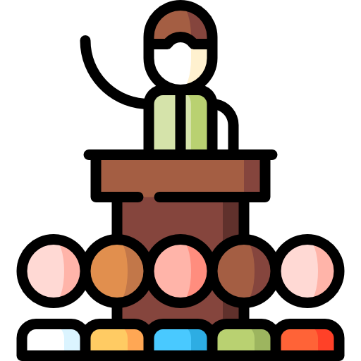</a> <a href="Civilizations_and_Nomads" title="Civilizations and Nomads"><b>Nomads</b></a> </li>

<li class="mainmenu-line"> <a href="Guide_to_Crafting" title="Crafting">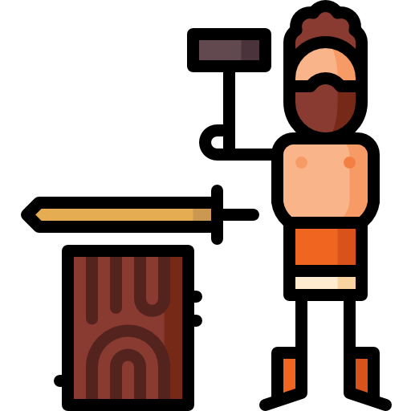</a> <a href="Guide_to_Crafting" title="Guide to Crafting"><b>Crafting</b></a> </li>

<li class="mainmenu-line"> <a href="Guide_to_Construction" title="Construction">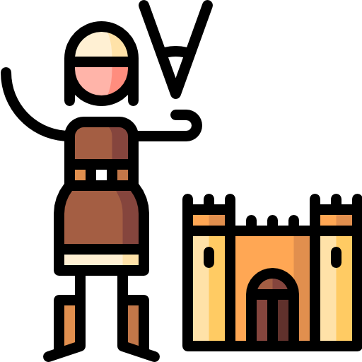</a> <a href="Guide_to_Construction" title="Guide to Construction"><b>Construction</b></a> </li>

<li class="mainmenu-line"> <a href="Guide_to_Farming" title="Guide to Farming">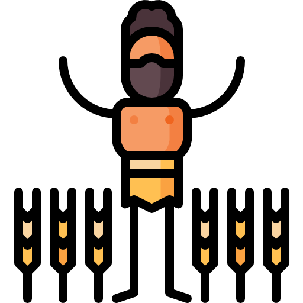</a> <a href="Guide_to_Farming" title="Guide to Farming"><b>Farming</b></a> </li>

<li class="mainmenu-line"> <a href="Guide_to_Ranching" title="Ranching">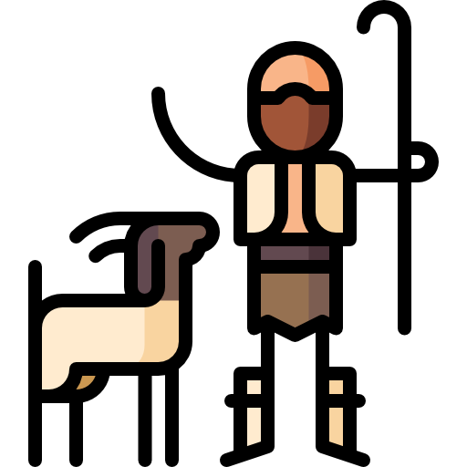</a> <a href="Guide_to_Ranching" title="Guide to Ranching"><b>Ranching</b></a> </li>

<li class="mainmenu-line"> <a href="Guide_to_Religion" title="Religion">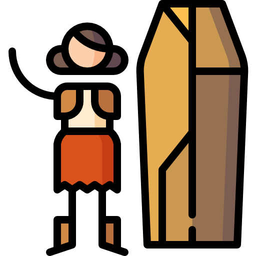</a> <a href="Guide_to_Religion" title="Guide to Religion"><b>Religion</b></a> </li>

<li class="mainmenu-line"> <a href="Guide_to_Cooking" title="Cooking">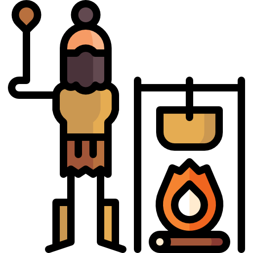</a> <a href="Guide_to_Cooking" title="Guide to Cooking"><b>Cooking</b></a> </li>

<li class="mainmenu-line"> <a href="Guide_to_Chemistry" title="Chemistry">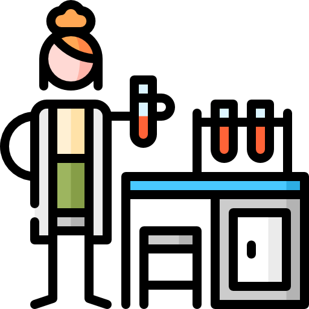</a> <a href="Guide_to_Chemistry" title="Guide to Chemistry"><b>Chemistry</b></a> </li>

<li class="mainmenu-line"> <a href="Guide_to_Hygiene_and_Mood" title="Hygiene and Mood">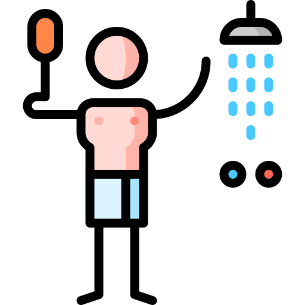</a> <a href="Guide_to_Hygiene_and_Mood" title="Guide to Hygiene and Mood"><b>Hygiene</b></a> </li>

<li class="mainmenu-line"> <a href="Guide_to_Races" title="Races">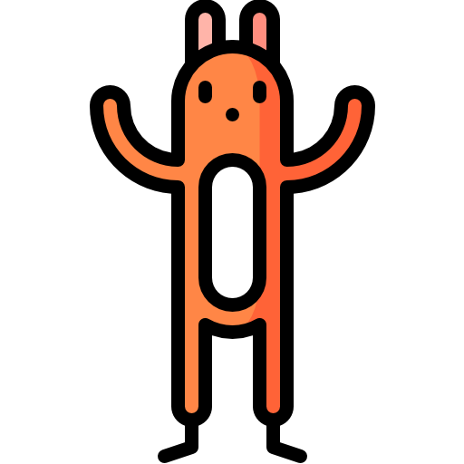</a> <a href="Guide_to_Races" title="Guide to Races"><b>Races</b></a> </li>

<li class="mainmenu-line"> <a href="Guide_to_Medical" title="Medical">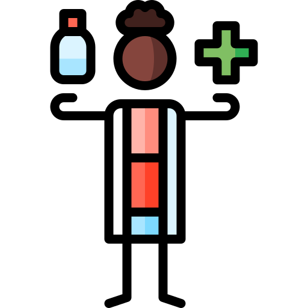</a> <a href="Guide_to_Medical" title="Guide to Medical"><b>Medical</b></a> </li>

<li class="mainmenu-line"> <a href="Guide_to_Weapons" title="Weapons">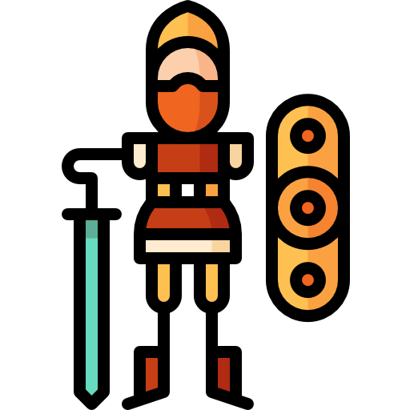</a> <a href="Guide_to_Weapons" title="Guide to Weapons"><b>Weapons</b></a> </li>

<li class="mainmenu-line"> <a href="Guide_to_Wiring" title="Wiring">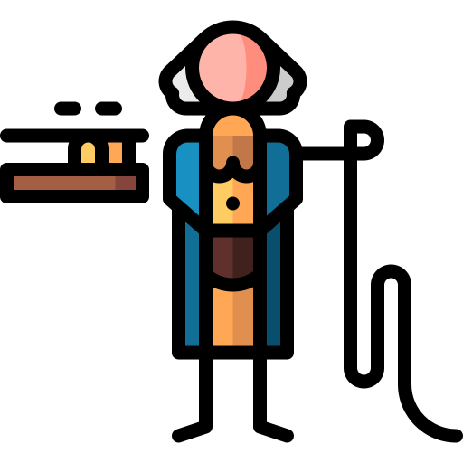</a> <a href="Guide_to_Wiring" title="Guide to Wiring"><b>Wiring</b></a> </li>

<li class="mainmenu-line">  <a href="Guide_to_Communications" title="Guide to Communications"><b>Communications</b></a> </li>

<li class="mainmenu-line"> <a href="Guide_to_Paperwork" title="Paperwork">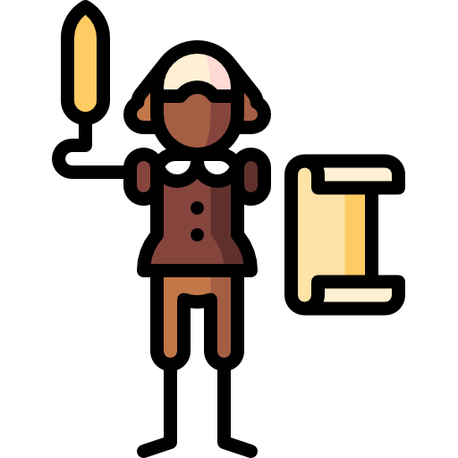</a> <a href="Guide_to_Paperwork" title="Guide to Paperwork"><b>Paperwork</b></a> </li>

<li class="mainmenu-line"> <a href="Guide_to_Radiation" title="Radiation">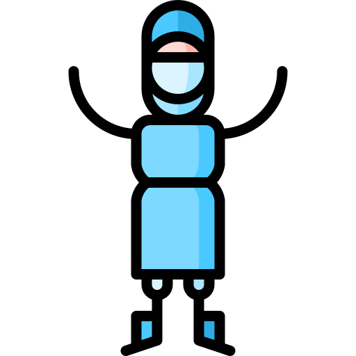</a> <a href="Guide_to_Radiation" title="Guide to Radiation"><b>Radiation</b></a> </li>

<li class="mainmenu-line">  <a href="Guide_to_Tanks" title="Guide to Tanks"><b>Tanks</b></a> </li>

<li class="mainmenu-line"> <a href="Full_Crafting_List" title="Full Crafting List">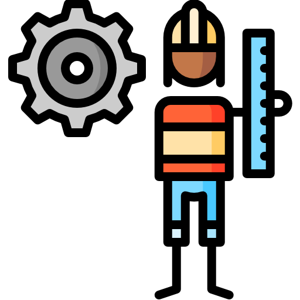</a> <a href="Full_Crafting_List" title="Full Crafting List"><b>Crafting List</b></a> </li>

<li class="mainmenu-line">  <a href="Rules" title="Rules"><b>Rules</b></a> </li>

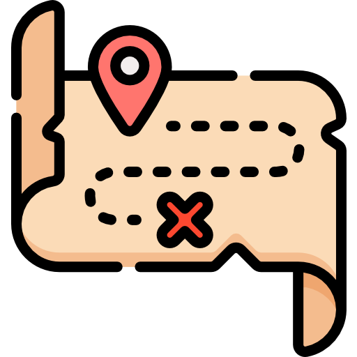 &nbsp; <b>Maps</b>

<table style="align-content:center;">
<tbody><tr>
<th style="align-content:center;"></th>
<th style="align-content:center;">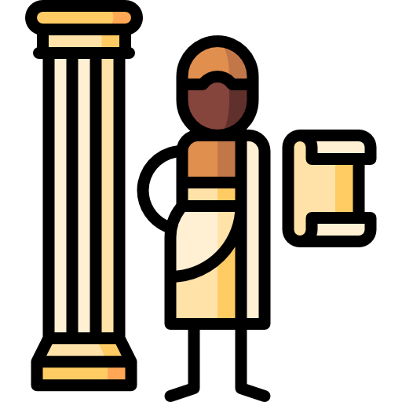</th>
<th style="align-content:center;"></th></tr>
<tr style="text-align: center;">
<th style="align-content:center;">Scenarios</th>
<th style="align-content:center;">Bronze Age</th>
<th style="align-content:center;">Medieval Age</th></tr>
<tr>
<td style="vertical-align: top;">

<a href="Nomads_Maps">Nomads Maps</a> 

<a href="The_Art_of_the_Deal">Art of the Deal</a> 

<a href="Alleyway">Alleyway</a> 

<a href="Tribes">Tribes</a> 
</td>
<td style="vertical-align: top;">

<a href="Gladiators">Gladiators</a> 

<a href="Heraclea">Heraclea</a> 

<a href="Siege">Siege</a> 

<a href="Teutoburg">Teutoburg</a> 

</td>
<td style="vertical-align: top;">

<a href="Karak">Karak</a> 

<a href="Camp">Camp</a> 

<a href="Sammirhayeed">Sammir Hayeed</a> 

<a href="Battleroyale#Medieval">Battleroyale (Medieval)</a> 

<a href="Bohemia">Bohemia</a> 

</td>
</tr>
<tr>
<th style="align-content:center;">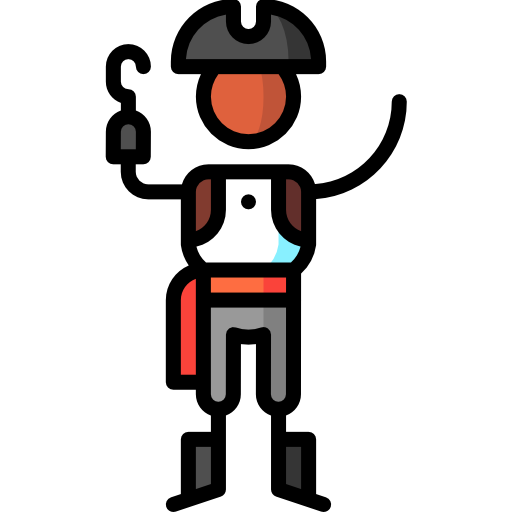</th>
<th style="align-content:center;">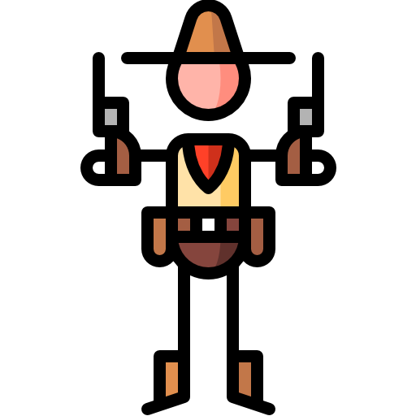</th>
<th style="align-content:center;">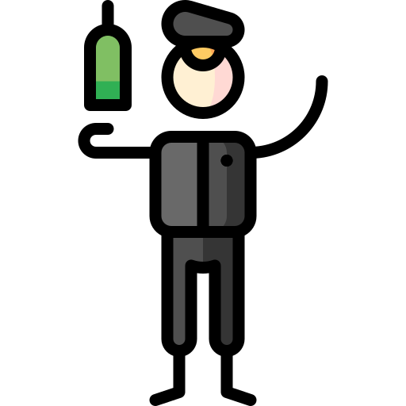</th></tr>
<tr style="text-align: center;">
<th style="align-content:center;">Imperial Age</th>
<th style="align-content:center;">Industrial Age</th>
<th style="align-content:center;">1st World War</th>
</tr>
<tr>
<td style="vertical-align: top;">

<a href="Colony">Colony</a> 

<a href="Four_Colonies">Four Colonies</a> 

<a href="Hunt">Hunt</a> 

<a href="Naval">Naval</a> 

<a href="Island">Island</a> 

<a href="Isla_Robusta">Isla Robusta</a> 

<a href="Supply_Raid">Supply Raid</a> 

<a href="Fields">Fields</a> 

<a href="Recife">Recife</a> 

<a href="Battleroyale#Imperial">Battleroyale (Imperial)</a> 

</td>
<td style="vertical-align: top;">

<a href="Little_Creek_RP">Little Creek (RP)</a> 

<a href="Little_Creek_TDM">Little Creek (TDM)</a> 

<a href="Missionary_Ridge">Missionary Ridge</a> 

<a href="Pioneers">Pioneers</a> 
</td>
<td style="vertical-align: top;">

<a href="Ypres">Ypres</a> 

<a href="Hill_203">Hill 203</a> 

<a href="Tsaritsyn">Tsaritsyn</a> 

<a href="Port_Arthur">Port Arthur</a> 

<a href="Santo_Tomas">Santo Tomas</a> 

<a href="Coloocan">Coloocan</a> 
</td>
</tr>
<tr>
<th style="align-content:center;">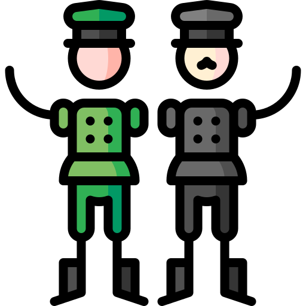</th>
<th style="align-content:center;">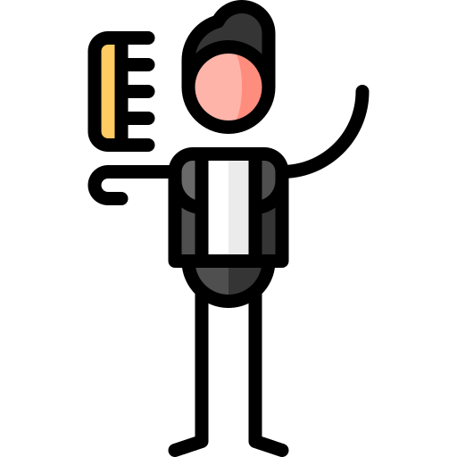</th>
<th style="align-content:center;">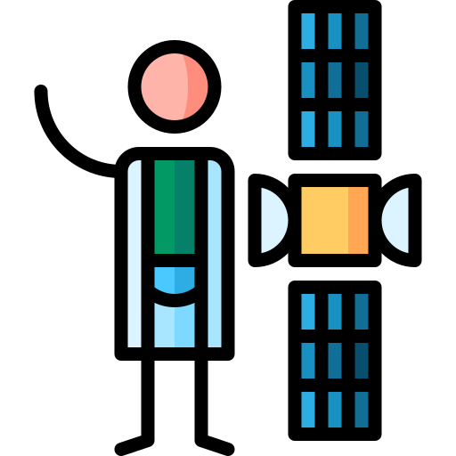</th></tr>
<tr style="text-align: center;">
<th style="align-content:center;">2nd World War</th>
<th style="align-content:center;">Cold War</th>
<th style="align-content:center;">Modern Age</th></tr>
<tr>

<td style="vertical-align: top;">

<a href="Gulag_13">Gulag 13</a> 

<a href="Reichstag">Reichstag</a> 

<a href="Intramuros">Intramuros</a> 

<a href="Iwo_Jima">Iwo Jima</a> 

<a href="Khalkyn_Gol">Khalkyn Gol</a> 

<a href="Kursk">Kursk</a> 

<a href="Nanjing">Nanjing</a> 

<a href="Omaha">Omaha</a> 

<a href="Rizal_Stadium">Rizal Stadium</a> 

<a href="Stalingrad">Stalingrad</a> 

<a href="Stalingrad#Smallingrad">Smallingrad</a> 

<a href="Wake Island">Wake Island</a> 
</td>
<td style="vertical-align: top;">

<a href="Compound">Compound</a> 

<a href="Road_to_Dak_To">Road to Dak To</a> 

<a href="Retreat">Retreat</a> 

</td>
<td style="vertical-align: top;">

<a href="Arab_Town">Arab Town</a> 

<a href="Arab_Town#Arab_Town_II">Arab Town II</a> 

<a href="Hostages">Hostages</a> 

<a href="Battleroyale#Modern">Battleroyale (Modern)</a> 
</td>
</tr>
</tbody></table>

## Other Things

[Contributing to this Wiki](Contributing_to_the_Wiki "wikilink")

[Games](Games "wikilink") (similar games and inspirations)
