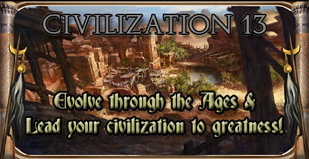

# Main Page

## What is this?

Civilization 13 (formerly 1713) is a free game based on Space Station 13 code and using the BYOND platform, which features several epochs of human history. (hence the name).

It features both Roleplay-oriented and Team-Deathmatch modes, with the main one being [Nomads](Civilizations_and_Nomads "wikilink"), in which you need to bring your civilization from the Stone Age to the Modern Age.

<b>To contribute, edit a page using the links on the top right. You will need a github account. For more information check the guide [here](Contributing_to_the_Wiki "wikilink").</b>

<b>[Official TDM Server](byond://civ13.com:1714) | [Official RP/Nomads Server](byond://civ13.com:1715) | [Official Persistence Server](byond://valzargaming.com:1714) | [Discord](https://discord.gg/hBEtg4x) | [Github](https://github.com/Civ13/Civ13)</b>

## Getting started

 &nbsp; <b>Basic Guides</b>

<ul>
<li style="display: inline-block;">  <a href="/New_Player_Guide" title="How to Play">How to Play</a> </li>

<li style="display: inline-block;">  <a href="/Starter_Guide" title="Starter Guide">Starter Guide</a> </li>

</ul>

 &nbsp; <b>Mechanics and Advanced Guides</b>

<table style="width: 100%; |">
<tbody><tr>
<th>
</th>
<th>
</th>
<th>
</th>
<th>
</th>
<th>
</th></tr>
<tr style="text-align: center;">
<th>General Guides
</th>
<th>Regulations and Laws
</th>
<th>Medical Guides
</th>
<th>Engineering Guides
</th>
<th>Research Guides
</th></tr>
<tr>
<td style="vertical-align: top;">
<ul><li><a href="/Guide_for_New_Players" title="Guide for New Players">Guide for New Players</a></li>

<li><a href="/Combat" title="Combat">Combat</a></li>

<li><a href="/Example_Paperwork" title="Example Paperwork">Example Paperwork</a></li>

<li><a href="/Guide_to_Paperwork" title="Guide to Paperwork">Guide to Paperwork</a></li>

<li><a href="/Records" title="Records">Records</a></li>

<li><a href="/Skills" title="Skills">Skills</a></li>

<li><a href="/Starter_Guide_to_Admin_Tools" title="Starter Guide to Admin Tools">Starter Guide to Admin Tools</a></li>
</ul>
</td>
<td style="vertical-align: top;">
<ul><li><a href="/How_To_Sol_Gov_Guide" title="How To Sol Gov Guide">How To Sol Gov Guide</a></li>

<li><a href="/Alert_Procedure" title="Alert Procedure">Alert Procedure</a></li>

<li><a href="/Corporate_Regulations" title="Corporate Regulations">Corporate Regulations</a></li>

<li><a href="/General_Regulations" title="General Regulations">General Regulations</a></li>

<li><a href="/Sol_Central_Government_Law" title="Sol Central Government Law">Sol Central Government Law</a></li>

<li><a href="/Sol_Code_of_Uniform_Justice" title="Sol Code of Uniform Justice">Sol Code of Uniform Justice</a></li>

<li><a href="/Standard_Operating_Procedure" title="Standard Operating Procedure">Standard Operating Procedure</a></li>

<li><a href="/Uniform_Guide" title="Uniform Guide">Uniform Guide</a></li>
</ul>
</td>
<td style="vertical-align: top;">
<ul><li><a href="/Guide_to_Medicine" title="Guide to Medicine">Guide to Medicine</a></li>

<li><a href="/Chemistry" title="Chemistry">Chemistry</a></li>

<li><a href="/Surgery" title="Surgery">Surgery</a></li>
</ul>
</td>
<td style="vertical-align: top;">
<ul><li><a href="/Engineering" title="Engineering">Engineering</a></li>

<li><a href="/Atmospherics" title="Atmospherics">Atmospherics</a></li>

<li><a href="/EVA" class="mw-redirect" title="EVA">EVA</a></li>

<li><a href="/Guide_to_Construction" title="Guide to Construction">Construction</a></li>

<li><a href="/Hacking" title="Hacking">Hacking</a></li>

<li><a href="/Hardsuit" title="Hardsuit">Hardsuit</a></li>

<li><a href="/Robotics" title="Robotics">Robotics</a></li>

<li><a href="/Solars" title="Solars">Solars</a></li>

<li><a href="/Supermatter_Engine" title="Supermatter Engine">Supermatter Engine</a></li>

<li><a href="/R-UST" title="R-UST">R-UST</a></li>

<li><a href="/Guide_to_Computing" title="Guide to Computing">NTNet and Computing</a></li>
</ul>
</td>
<td style="vertical-align: top;">
<ul><li><a href="/Research_%26_Development" title="Research &amp; Development">Research &amp; Development</a></li>

<li><a href="/Destructive_Analyzer" title="Destructive Analyzer">Destructive Analyzer</a></li>

<li><a href="/Guide_to_Anomalies" title="Guide to Anomalies">Guide to Anomalies</a></li>

<li><a href="/Mining" title="Mining">Mining</a></li>

<li><a href="/Xenoarcheology" title="Xenoarcheology">Xenoarcheology</a></li>

<li><a href="/Guide_to_Xenobiology" title="Guide to Xenobiology">Xenobiology</a></li>

<li><a href="/Xenobotany" title="Xenobotany">Xenobotany</a></li>
</ul>
</td></tr></tbody></table>

[Rules](Rules "wikilink")

[New Player Guide](New_Player_Guide "wikilink")

Guide to [Civilizations and Nomads](Civilizations_and_Nomads "wikilink")
mode

[Guide to Races/Species](Guide_to_Races "wikilink")

[Guide to Medical](Guide_to_Medical "wikilink")

[Guide to Crafting](Guide_to_Crafting "wikilink")

[Guide to Cooking](Guide_to_Cooking "wikilink")

[Guide to Farming](Guide_to_Farming "wikilink")

[Guide to Weapons](Guide_to_Weapons "wikilink")

[Guide to Ranching](Guide_to_Ranching "wikilink")

[Guide to Wiring](Guide_to_Wiring "wikilink")

[Guide to Communications](Guide_to_Communications "wikilink")

[Guide to Religion](Guide_to_Religion "wikilink")

[Guide to Paperwork](Guide_to_Paperwork "wikilink")

[Guide to Hygiene and Mood](Guide_to_Hygiene_and_Mood "wikilink")

[Guide to Radiation](Guide_to_Radiation "wikilink")

[Guide to Chemistry](Guide_to_Chemistry "wikilink")

[Guide to Tanks](Guide_to_Tanks "wikilink")

[Custom Colors](Custom_Colors "wikilink")

[Full Crafting List](Full_Crafting_List "wikilink")

## Maps

### Civilization Mode

Lead your Civilization from prehistory to the modern era!

**RP:** [Civilizations and Nomads](Civilizations_and_Nomads "wikilink")

### The Art of the Deal

Negotiate and betray in this mode.

**RP: [The Art of the Deal](The_Art_of_the_Deal "wikilink")**

### 313 B.C.

Ancient Greece and Romans. Phalanxes vs Legions.

**TDM:** [Heraclea](Heraclea "wikilink") - [Siege](Siege "wikilink")

### 1013 A.D.

Medieval Europe and the Crusades.

**TDM:** [Camp](Camp "wikilink") - [Karak](Karak "wikilink") -
[Sammirhayeed](Sammirhayeed "wikilink")

### 1713 A.D.

Colonial America. Piracy and Colonization

**TDM:** [Naval](Naval "wikilink") - [Island](Island "wikilink") -
[Robusta](Robusta "wikilink") - [Supply Raid](Supply_Raid "wikilink") -
[Recife](Recife "wikilink")

**RP:** [Hunt](Hunt "wikilink") - [Colony](Colony "wikilink")

### 1803 A.D.

Napoleonic Wars and War of 1812

**TDM:** [Alamo](Alamo "wikilink") - [Gettysburg](Gettysburg "wikilink")

### 1873 A.D.

The Wild West and the American Civil War.

**TDM:** [Little Creek TDM](Little_Creek_TDM "wikilink")

**RP:** [Little Creek RP](Little_Creek_RP "wikilink") -
[Pioneers](Pioneers "wikilink")

### 1903 A.D.

Victorian Era and the Russo-Japanese war.

**TDM:** [Hill 203](Hill_203 "wikilink") -
[Ypress](Ypress "wikilink") - [Tsaritsyn](Tsaritsyn "wikilink")

### 1943 A.D.

World War II.

**TDM:** [Omaha](Omaha "wikilink") - [Reichstag](Reichstag "wikilink") - [Kursk](Kursk "wikilink") - [Nanjing](Nanjing "wikilink") - [Khalkhyn gol](Khalkhyn_gol "wikilink")

**RP:** [Gulag](Gulag "wikilink")

### 1969 A.D.

Cold War and and Proxy wars.

**TDM:** [Compound](Compound "wikilink") - [Road toDak-to](Road_to_Dak-to "wikilink")

### 2013 A.D.

War on Terror and Political conflict.

**TDM:** [Arab Town](Arab_Town "wikilink") - [Hostages](Hostages "wikilink")

## Media and other things

[Games](Games "wikilink") (similar games and inspirations)
