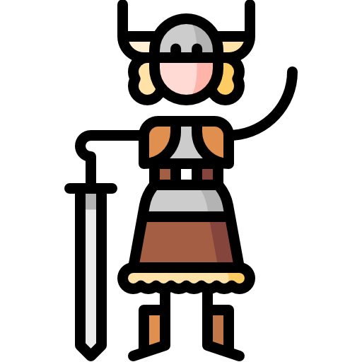

# Main Page

## What is this?

Civilization 13 (formerly 1713) is a free game based on Space Station 13 code and using the BYOND platform, which features several epochs of human history. (hence the name).

It features both Roleplay-oriented and Team-Deathmatch modes, with the main one being [Nomads](Civilizations_and_Nomads "wikilink"), in which you need to bring your civilization from the Stone Age to the Modern Age.

<b>To contribute, edit a page using the links on the top right. You will need a github account. For more information check the guide [here](Contributing_to_the_Wiki "wikilink").</b>

<b>[Official TDM Server](byond://civ13.com:1714) | [Official RP/Nomads Server](byond://civ13.com:1715) | [Official Persistence Server](byond://valzargaming.com:1714) | [Discord](https://discord.gg/hBEtg4x) | [Github](https://github.com/Civ13/Civ13)</b>

## Getting started

 &nbsp; <b>Guides</b>

<li style="display: inline-block;text-align:center">  <a href="New_Player_Guide" title="How to Play">How to Play</a> </li>

<li style="display: inline-block;text-align:center">  <a href="Starter_Guide" title="Starter Guide">Starter Guide</a> </li>

<li style="display: inline-block;text-align:center">  <a href="Civilizations_and_Nomads" title="Civilizations and Nomads">Nomads</a> </li>

<li style="display: inline-block;text-align:center">  <a href="Guide_to_Crafting" title="Guide to Crafting">Crafting</a> </li>

<li style="display: inline-block;text-align:center">  <a href="Guide_to_Construction" title="Guide to Construction">Construction</a> </li>

<li style="display: inline-block;text-align:center">  <a href="Guide_to_Farming" title="Guide to Farming">Farming</a> </li>

<li style="display: inline-block;text-align:center">  <a href="Guide_to_Ranching" title="Guide to Ranching">Ranching</a> </li>

<li style="display: inline-block;text-align:center">  <a href="Guide_to_Religion" title="Guide to Religion">Religion</a> </li>

<li style="display: inline-block;text-align:center">  <a href="Guide_to_Cooking" title="Guide to Cooking">Cooking</a> </li>

<li style="display: inline-block;text-align:center">  <a href="Guide_to_Chemistry" title="Guide to Chemistry">Chemistry</a> </li>

<li style="display: inline-block;text-align:center">  <a href="Guide_to_Hygiene_and_Mood" title="Guide to Hygiene and Mood">Hygiene</a> </li>

<li style="display: inline-block;text-align:center">  <a href="Guide_to_Races" title="Guide to Races">Races</a> </li>

<li style="display: inline-block;text-align:center">  <a href="Guide_to_Medical" title="Guide to Medical">Medical</a> </li>

<li style="display: inline-block;text-align:center">  <a href="Guide_to_Weapons" title="Guide to Weapons">Weapons</a> </li>

<li style="display: inline-block;text-align:center">  <a href="Guide_to_Wiring" title="Guide to Wiring">Wiring</a> </li>

<li style="display: inline-block;text-align:center">  <a href="Guide_to_Communications" title="Guide to Communications">Communications</a> </li>

<li style="display: inline-block;text-align:center">  <a href="Guide_to_Paperwork" title="Guide to Paperwork">Paperwork</a> </li>

<li style="display: inline-block;text-align:center">  <a href="Guide_to_Radiation" title="Guide to Radiation">Radiation</a> </li>

<li style="display: inline-block;text-align:center">  <a href="Guide_to_Tanks" title="Guide to Tanks">Tanks</a> </li>

<li style="display: inline-block;text-align:center">  <a href="Full_Crafting_List" title="Full Crafting List">Full Crafting List</a> </li>

<li style="display: inline-block;text-align:center">  <a href="Rules" title="Rules">Rules</a> </li>

 &nbsp; <b>Maps</b>

<table style="width: 100%; align-content:center;">
<tbody><tr>
<th>
</th>
<th>
</th>
<th>
</th>
<th>
</th>
<th>
</th></tr>
<tr style="text-align: center;">
<th>Nomads
</th>
<th>Bronze Age
</th>
<th>Medieval Age
</th>
<th>Imperial Age
</th>
<th>Industrial Age
</th></tr>
<tr>
<td style="vertical-align: top;">

<a href="PLACEHOLDER">PLACEHOLDER</a>

<a href="PLACEHOLDER">PLACEHOLDER</a>

<a href="PLACEHOLDER">PLACEHOLDER</a>

<a href="PLACEHOLDER">PLACEHOLDER</a>

<a href="PLACEHOLDER">PLACEHOLDER</a>

</td>
<td style="vertical-align: top;">

<a href="Heraclea">Heraclea</a> 

<a href="Siege">Siege</a> 

<a href="Teutoburg">Teutoburg</a> 

</td>
<td style="vertical-align: top;">

<a href="Karak">Karak</a> 

<a href="Camp">Camp</a> 

<a href="Sammirhayeed">Sammir Hayeed</a> 

<a href="Battle Royale#Medieval">Medieval Battle Royale</a> 

<a href="Bohemia">Bohemia</a> 

</td>
<td style="vertical-align: top;">

<a href="Colony">Colony</a> 

<a href="PLACEHOLDER">PLACEHOLDER</a>

<a href="PLACEHOLDER">PLACEHOLDER</a>

<a href="PLACEHOLDER">PLACEHOLDER</a>

<a href="PLACEHOLDER">PLACEHOLDER</a>

</td>
<td style="vertical-align: top;">

<a href="PLACEHOLDER">PLACEHOLDER</a>

<a href="PLACEHOLDER">PLACEHOLDER</a>

<a href="PLACEHOLDER">PLACEHOLDER</a>

<a href="PLACEHOLDER">PLACEHOLDER</a>

<a href="PLACEHOLDER">PLACEHOLDER</a>

</td>
</tr>
<tr>
<th>
</th>
<th>
</th>
<th>
</th>
<th>
</th>
<th>
</th></tr>
<tr style="text-align: center;">
<th>1st World War
</th>
<th>2nd World War
</th>
<th>Cold War
</th>
<th>Modern Age
</th>
<th>Scenarios
</th></tr>
<tr>
<td style="vertical-align: top;">

<a href="PLACEHOLDER">PLACEHOLDER</a>

<a href="PLACEHOLDER">PLACEHOLDER</a>

<a href="PLACEHOLDER">PLACEHOLDER</a>

<a href="PLACEHOLDER">PLACEHOLDER</a>

<a href="PLACEHOLDER">PLACEHOLDER</a>

</td>
<td style="vertical-align: top;">

<a href="PLACEHOLDER">PLACEHOLDER</a>

<a href="PLACEHOLDER">PLACEHOLDER</a>

<a href="PLACEHOLDER">PLACEHOLDER</a>

<a href="PLACEHOLDER">PLACEHOLDER</a>

<a href="PLACEHOLDER">PLACEHOLDER</a>

</td>
<td style="vertical-align: top;">

<a href="PLACEHOLDER">PLACEHOLDER</a>

<a href="PLACEHOLDER">PLACEHOLDER</a>

<a href="PLACEHOLDER">PLACEHOLDER</a>

<a href="PLACEHOLDER">PLACEHOLDER</a>

<a href="PLACEHOLDER">PLACEHOLDER</a>

</td>
<td style="vertical-align: top;">

<a href="PLACEHOLDER">PLACEHOLDER</a>

<a href="PLACEHOLDER">PLACEHOLDER</a>

<a href="PLACEHOLDER">PLACEHOLDER</a>

<a href="PLACEHOLDER">PLACEHOLDER</a>

<a href="PLACEHOLDER">PLACEHOLDER</a>

</td>
<td style="vertical-align: top;">

<a href="PLACEHOLDER">PLACEHOLDER</a>

<a href="PLACEHOLDER">PLACEHOLDER</a>

<a href="PLACEHOLDER">PLACEHOLDER</a>

<a href="PLACEHOLDER">PLACEHOLDER</a>

<a href="PLACEHOLDER">PLACEHOLDER</a>

</td>
</tr>
</tbody></table>

## Maps

### Civilization Mode

Lead your Civilization from prehistory to the modern era!

**RP:** [Civilizations and Nomads](Civilizations_and_Nomads "wikilink")

### The Art of the Deal

Negotiate and betray in this mode.

**RP: [The Art of the Deal](The_Art_of_the_Deal "wikilink")**

### 313 B.C.

Ancient Greece and Romans. Phalanxes vs Legions.

**TDM:** [Heraclea](Heraclea "wikilink") - [Siege](Siege "wikilink")

### 1013 A.D.

Medieval Europe and the Crusades.

**TDM:** [Camp](Camp "wikilink") - [Karak](Karak "wikilink") -
[Sammirhayeed](Sammirhayeed "wikilink")

### 1713 A.D.

Colonial America. Piracy and Colonization

**TDM:** [Naval](Naval "wikilink") - [Island](Island "wikilink") -
[Robusta](Robusta "wikilink") - [Supply Raid](Supply_Raid "wikilink") -
[Recife](Recife "wikilink")

**RP:** [Hunt](Hunt "wikilink") - [Colony](Colony "wikilink")

### 1803 A.D.

Napoleonic Wars and War of 1812

**TDM:** [Alamo](Alamo "wikilink") - [Gettysburg](Gettysburg "wikilink")

### 1873 A.D.

The Wild West and the American Civil War.

**TDM:** [Little Creek TDM](Little_Creek_TDM "wikilink")

**RP:** [Little Creek RP](Little_Creek_RP "wikilink") -
[Pioneers](Pioneers "wikilink")

### 1903 A.D.

Victorian Era and the Russo-Japanese war.

**TDM:** [Hill 203](Hill_203 "wikilink") -
[Ypress](Ypress "wikilink") - [Tsaritsyn](Tsaritsyn "wikilink")

### 1943 A.D.

World War II.

**TDM:** [Omaha](Omaha "wikilink") - [Reichstag](Reichstag "wikilink") - [Kursk](Kursk "wikilink") - [Nanjing](Nanjing "wikilink") - [Khalkhyn gol](Khalkhyn_gol "wikilink")

**RP:** [Gulag](Gulag "wikilink")

### 1969 A.D.

Cold War and and Proxy wars.

**TDM:** [Compound](Compound "wikilink") - [Road toDak-to](Road_to_Dak-to "wikilink")

### 2013 A.D.

War on Terror and Political conflict.

**TDM:** [Arab Town](Arab_Town "wikilink") - [Hostages](Hostages "wikilink")

## Media and other things

[Games](Games "wikilink") (similar games and inspirations)
