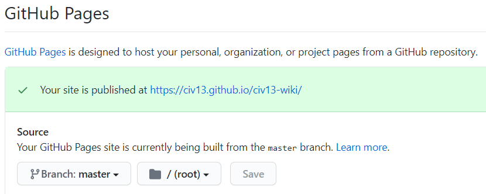
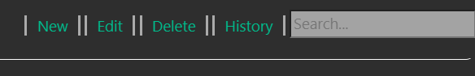
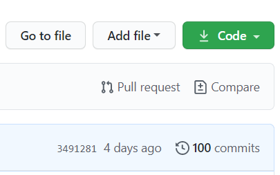

# Contributing to the Wiki

**You can check what pages need fixing/content on the [github Issues section](https://github.com/Civ13/civ13-wiki/issues).**

Since this wiki is hosted on *github pages* using static Jekyll pages, it works slightly different from a regularly hosted wiki.

However, don't worry! It is simpler than it seems. You do **not** need to download the code (although you can if you want to edit it locally). Follow the steps below:

**1) If you do not have one yet, register for a *Github Account* [here](https://github.com/join).**

**2) Fork the wiki by going to the main project page [here](https://github.com/Civ13/civ13-wiki) and pressing the *Fork* button on the top right.**


**3) Go to your fork of the wiki (will be something like *YOURUSERNAME*.github.com/civ13-wiki), open settings, and scroll down to *GitHub Pages*. Make sure it looks similar to the screenshot below by activating Github Pages:**



**4) Your fork of the wiki is now live! You can now open the wiki using the link shown there. It will look similar to https://**YOURUSERNAME**.github.io/civ13-wiki**

**5) You're all set! Just edit by either creating a new page, or selecting *edit* on the top right menu, like the image below:**



**6) The wiki pages are written in markdown and have the *.md* extension - for more information on the markdown language and how to type in bold, italic, and so on, check [this page](https://docs.github.com/en/github/writing-on-github/getting-started-with-writing-and-formatting-on-github/basic-writing-and-formatting-syntax). They are located in the wiki/ folder. If you add any images, put them in images/. You can also use HTML on the pages if you need to, but its the best practice to keep to markdown unless its something you need html for (i.e., sortable tables).**

**7) When you feel that your changes are good enough, just open a pull request to the main repository (the one you forked), and if accepted, it will be displayed on the page! To open a pull request, go to the master branch (our github page) and click *Pull Requests* then *New Pull Request*.**

**8) Make sure you regularly update your repository to keep it up to date! You can do this using pull requests from master. Open your fork page on github and click *Pull Request* as per the image below:**



Or in your fork page on github click on *Fetch Upstream*, it will update your fork to have all the merged pull requests of the Civ-13 master.

## Images

While you can link external images using either markdown or html tags, we recommend that you upload them to **images/** and link them from there. Make sure they have a unique name as to not replace current images!

## Downloading the code

If you prefer to edit the files locally, and/or want to experiment with the website layout, follow the steps below:

1. If you haven't, follow the steps **1** and **2** on the list above.

2. Using your preferred git client, download your fork (If you have no idea of what I'm talking about, use [GitHub Desktop](https://desktop.github.com/)).

3. Open the command line on whatever operating system you are using (***Terminal*** on Linux and MacOS, ***cmd*** or ***PowerShell*** on Windows), navigate to the civ13-wiki/ folder and run `./mdbook.exe build --open`. This will compile the wiki and open the browser to display it.

4. To help with editing, you can run `./mdbook.exe watch --open`, and when viewing it on the browser it will refresh every time you make an edit to the files.

## DMI Sprites (`<dmi-sprite>`)

The wiki supports rendering sprites directly from `.dmi` files (the icon format used by BYOND/SS13) using a custom HTML element.

```admonish note
Sprites are fetched over HTTP and will only display when the wiki is served via a web server (e.g. `./mdbook.exe serve`, or the live GitHub Pages site). They **will not** appear when opening an `.html` file directly from the filesystem (`file://`), due to browser security restrictions on cross-origin fetching.
```

### Basic syntax

```html
<dmi-sprite src="URL_TO_FILE.dmi" state="state_name"></dmi-sprite>
```

### Attributes

| Attribute  | Required | Default | Description                                                                                                                                                                                                                     |
| ---------- | -------- | ------- | ------------------------------------------------------------------------------------------------------------------------------------------------------------------------------------------------------------------------------- |
| `src`      | ✅ Yes    | —       | Full URL to the `.dmi` file. Use raw GitHub URLs, e.g. `https://raw.githubusercontent.com/civ13/civ13/master/icons/...`                                                                                                         |
| `state`    | ✅ Yes    | `""`    | The icon state name inside the DMI to display (case-sensitive, must match exactly).                                                                                                                                             |
| `dir`      | No       | `south` | Direction to display. Accepts: `south`, `north`, `east`, `west`, `southeast`, `southwest`, `northeast`, `northwest` (or their BYOND numeric codes `1`, `2`, `4`, `8`, etc.). Falls back to `south` if the state has fewer dirs. |
| `animated` | No       | `false` | Set to `"true"` to play the animation if the state has multiple frames.                                                                                                                                                         |
| `scale`    | No       | `1`     | Integer pixel scale multiplier. Use `2` or `3` for a larger display (e.g. a 32×32 sprite becomes 64×64 or 96×96).                                                                                                               |

### Examples

**Static sprite (south-facing, default size):**
```html
<dmi-sprite src="https://raw.githubusercontent.com/civ13/civ13/master/icons/obj/items.dmi" state="knife"></dmi-sprite>
```

**Animated sprite, scaled up 2×:**
```html
<dmi-sprite src="https://raw.githubusercontent.com/civ13/civ13/master/icons/mob/human.dmi" state="human" dir="south" animated="true" scale="2"></dmi-sprite>
```

**Centred in a paragraph (wrap in a `<div>` or `<p>`):**
```html
<div style="text-align: center;">
  <dmi-sprite src="https://raw.githubusercontent.com/civ13/civ13/master/icons/lobby/lights_out.dmi" state="lights_out" animated="true" scale="2"></dmi-sprite>
</div>
```

### Tips

- The `src` must be a **raw** GitHub URL (starting with `https://raw.githubusercontent.com/`), not a regular GitHub page URL.
- State names are **case-sensitive** and must match the name as it appears inside the `.dmi` file exactly.
- If nothing appears, check that the state name is correct and that you are viewing the page through a server (not via `file://`).
- You can mix `<dmi-sprite>` with regular markdown or HTML — it is an inline element by default.