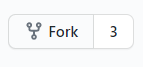

# Contributing to the Wiki

**You can check what pages need fixing/content on the [github Issues section](https://github.com/Civ13/civ13-wiki/issues).**

This wiki is hosted on *GitHub Pages* using [mdBook](https://rust-lang.github.io/mdBook/), a modern static site generator. 

However, don't worry! It is simpler than it seems. You do **not** need to download the code (although you can if you want to edit it locally). Follow the steps below:

**1) If you do not have one yet, register for a *GitHub Account* [here](https://github.com/join).**

**2) Fork the wiki by going to the main project page [here](https://github.com/Civ13/civ13-wiki) and pressing the *Fork* button on the top right.**



**3) Your fork is now ready to contribute to! You can edit pages directly on GitHub using the web editor.**

**4) When you feel that your changes are good enough, open a pull request to the main repository. To do this, go to your fork and click *Pull Requests* → *New Pull Request*, then follow the prompts.**

**5) Make sure you regularly sync your fork with the main repository to stay up to date! On your fork page, click *Sync fork* and select *Update branch* to pull in the latest changes.**

## Editing on GitHub (No Download Required)

The simplest way to contribute is to edit directly on GitHub:

1. Navigate to the file you want to edit in the `src/` folder
2. Click the **Edit** (pencil icon) button in the top right
3. Make your changes in the markdown editor
4. Scroll down, write a commit message describing your changes, and click **Commit changes**
5. Create a pull request with your changes
6. A maintainer will review and merge if approved

**Wiki pages are written in markdown** (`.md` files) — learn more about markdown syntax [here](https://docs.github.com/en/github/writing-on-github/getting-started-with-writing-and-formatting-on-github/basic-writing-and-formatting-syntax).

## Local Development (Download & Edit)

If you prefer to edit the files locally, test changes, or experiment with the website layout:

### Prerequisites

- **Windows**: mdBook is prepackaged as `mdbook.exe` in this repository (no installation needed!)
- **macOS/Linux**: Install [Rust](https://rustup.rs/) then run `cargo install mdbook`

### Setup

1. Fork and clone the repository to your computer

2. Using your preferred git client (or [GitHub Desktop](https://desktop.github.com/)), clone your fork

3. Navigate to the `civ13-wiki/` folder in your terminal/command prompt

### Building & Serving

**Windows (Using Prepackaged mdbook.exe):**
```powershell
# Build and open in browser
.\mdbook.exe build --open

# For development with live reloading
.\mdbook.exe serve
```

**macOS/Linux:**
```bash
# Build and open in browser
mdbook build --open

# For development with live reloading
mdbook serve
```

The wiki will be served at `http://localhost:3000`. When using `mdbook serve`, the page automatically refreshes whenever you save changes to markdown files.

### File Organization

- `src/` — All markdown source files (the content you edit)
- `src/SUMMARY.md` — Wiki table of contents and navigation structure
- `images/` — Images and sprites used in pages
- `book/` — Compiled output (generated automatically, do not edit)
- `theme/` — mdBook theme customization

### Adding Images

When adding images to wiki pages:

1. Upload your image to the `images/` folder (or appropriate subfolder like `images/entities/`, `images/food/`, etc.)
2. Reference it in markdown using: ``
3. Make sure the filename is **unique** to avoid conflicts with existing images

## Images

## DMI Sprites (`<dmi-sprite>`)

The wiki supports rendering sprites directly from `.dmi` files (the icon format used by BYOND/SS13) using a custom HTML element.

```admonish note
Sprites are fetched over HTTP and will only display when the wiki is served via a web server (e.g. `./mdbook.exe serve`, or the live GitHub Pages site). They **will not** appear when opening an `.html` file directly from the filesystem (`file://`), due to browser security restrictions on cross-origin fetching.
```

### Basic syntax

```html
<dmi-sprite src="URL_TO_FILE.dmi" state="state_name"></dmi-sprite>
```

### Attributes

| Attribute  | Required | Default | Description                                                                                                                                                                                                                     |
| ---------- | -------- | ------- | ------------------------------------------------------------------------------------------------------------------------------------------------------------------------------------------------------------------------------- |
| `src`      | ✅ Yes    | —       | Full URL to the `.dmi` file. Use raw GitHub URLs, e.g. `https://raw.githubusercontent.com/civ13/civ13/master/icons/...`                                                                                                         |
| `state`    | ✅ Yes    | `""`    | The icon state name inside the DMI to display (case-sensitive, must match exactly).                                                                                                                                             |
| `dir`      | No       | `south` | Direction to display. Accepts: `south`, `north`, `east`, `west`, `southeast`, `southwest`, `northeast`, `northwest` (or their BYOND numeric codes `1`, `2`, `4`, `8`, etc.). Falls back to `south` if the state has fewer dirs. |
| `animated` | No       | `false` | Set to `"true"` to play the animation if the state has multiple frames.                                                                                                                                                         |
| `scale`    | No       | `1`     | Integer pixel scale multiplier. Use `2` or `3` for a larger display (e.g. a 32×32 sprite becomes 64×64 or 96×96).                                                                                                               |

### Examples

**Static sprite (south-facing, default size):**
```html
<dmi-sprite src="https://raw.githubusercontent.com/civ13/civ13/master/icons/obj/items.dmi" state="knife"></dmi-sprite>
```

**Animated sprite, scaled up 2×:**
```html
<dmi-sprite src="https://raw.githubusercontent.com/civ13/civ13/master/icons/mob/human.dmi" state="human" dir="south" animated="true" scale="2"></dmi-sprite>
```

**Centred in a paragraph (wrap in a `<div>` or `<p>`):**
```html
<div style="text-align: center;">
  <dmi-sprite src="https://raw.githubusercontent.com/civ13/civ13/master/icons/lobby/lights_out.dmi" state="lights_out" animated="true" scale="2"></dmi-sprite>
</div>
```

### Tips

- The `src` must be a **raw** GitHub URL (starting with `https://raw.githubusercontent.com/`), not a regular GitHub page URL.
- State names are **case-sensitive** and must match the name as it appears inside the `.dmi` file exactly.
- If nothing appears, check that the state name is correct and that you are viewing the page through a server (not via `file://`).
- You can mix `<dmi-sprite>` with regular markdown or HTML — it is an inline element by default.