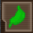

# Starter Guide

```admonish info
This guide mostly pertains to survival in the sandbox [Civilizations and Nomads](gamemodes/Civilizations_and_Nomads.md) game mode.
```

## Spawning in

- When you spawn, you will be told the languages you know. Your appearance and language will be determined by your spawn location.
- Your **hunger** and **thirst** levels will both be at 50%.
- You start out with nothing but age-appropriate clothes on your person. Your first priority will be gathering flint to make a flint axe.
  - Find a large rock and click it with an empty hand on **Grab intent** — you should be able to gather some flint.
  - Click the rock repeatedly with the flint to sharpen it. You will get a message when it is sharpened.
  - Now go to a tree and click it with an empty hand on **Harm intent**. This will pull a branch from the tree and place it on the ground.
  - Click the branch with an empty hand on **Grab intent** to clear the leaves, then click again on **Harm intent** to pull out the twigs.
  - Use the sharpened flint to sharpen the stick, then click the sharpened stick with the flint again to craft a trusty flint axe — a tool and a weapon.
- If it's **winter season** or an **Ice Age** map, you also spawn with a **fur coat**. Losing it will mean cold and miserable **death** in the icy outdoors.

## Crafting Basics

You will need some basic things to survive. At the very start you will most likely be using **wood** to make them.

- Hit a tree with your flint hatchet and it will be cut down after a delay.
- Get the wood and use it in the active hand to open a crafting menu.

The same mechanic applies to all materials: activate an item in your hand to open the crafting menu.

### Mining 101

Ores are valuable crafting materials mined from rock.

- You'll need **wood** and **bone** for this. Go gather them. Bones are obtained by butchering animals — click the carcass with something sharp, like a flint axe or a knife.
- Make a **tool handle** from **wood** (see the "Tools" section).
- Hold it in the **off-hand**.
- Activate some **bone** in your **active hand**.
- Make a **bone pickaxe**.
- Find an **underground rock** tile (either on the surface or underground — see the **[Shelter](#shelter)** section about digging underground).
- Use the **pickaxe** on it.

```admonish danger
Mining without supports can collapse the tunnel and kill you. If mining underground, build mining supports with wood every two tiles or you may trigger a cave-in!
```

More details about mining are **[here](guides/Guide_to_Crafting.md#mining)**.

What to do with metal ores — **[Guide to Metallurgy](guides/Guide_to_Metallurgy.md)**.

## Staying alive

To survive, you need to keep yourself nourished and warm.

<br>
Click your **Thirst** and **Hunger** **icon** on the right side (stomach icon) to know how you're doing.

**Letting either hunger or thirst reach 0% will cause your body to start shutting down, leading to inevitable death!**

Hunger and thirst affect your **movement speed**, **healing rates**, and **[mood](#mood)**.

Being slow makes you easy prey for predators, criminals, and cannibals. Malnourishment also makes it easier to catch **[diseases](guides/Guide_to_Medical.md#diseases)**.

### Hunger

The easiest way to get food early on is by killing animals and eating the meat after cooking it. You can also eat bird eggs, even uncooked.

- Find an animal, preferably one that does not have fangs, claws, tusks, or poison, and kill it with any means (even bare fists work). **Stay away from bears, alligators, wolves, snakes, and mammoths.**
- Use your knife (a flint axe works too) on the dead animal with **Harm intent** to butcher it.
- **Raw meat** causes **food poisoning**! You'll want to **cook** it, **stew** it, or **dry** it first, but if you're starving, food poisoning is the least of your worries.
- To cook meat, place it on a **campfire** and click the campfire.
  - Campfire is made with **wood logs** ("kitchen" section).
  - You can also roast meat in an **oven**.
- To **dry** meat, cut the raw steak into **raw cutlets** with a knife, then place them on a **dehydrator** and wait.
  - Dehydrators are made of **wood**, but you need some research levels.
- To **stew** meat, place the raw steak into the **cooking pot** after filling it with **water**, and wait.
  - Cooking pots are made with **iron ingots**, but again, it requires research levels to make.

There are many ways to fill your stomach. Even an *unga dunga* can do it!

- **[Guide to Ranching](guides/Guide_to_Ranching.md)**
- **[Guide to Farming](guides/Guide_to_Farming.md)**
- **[Guide to Cooking](guides/Guide_to_Cooking.md)**
- **[Guide to Fishing](guides/Guide_to_Fishing.md)**

### Thirst

The easiest way to quench your thirst early on is by drinking water or milk, though other liquids like **tea** can also help.

#### Water

You can get water from **puddles**, any **water tiles** (except saltwater — do not drink or boil it!), or **wells**.

```admonish warning
Avoid drinking "raw" water from puddles, rivers, and lakes! It needs to be boiled to be safe. Wells are the safest early water source, but keep them clear of nearby excrement.
```

```admonish tip
If you have no boilable container, milk and well water are safer than drinking directly from open puddles.
```

- To drink, you need a **mug** made of **wood** or a **drinking glass** made of **glass**.
- **Wells** have disease-free freshwater. However, if there is excrement within four tiles of a well, the water becomes contaminated and unsafe to drink.
- You can build a well over a **puddle** by using **stone**, if your faction has the required research levels.
- "Raw" water needs to be **boiled** to be 100% safe. Otherwise, you have a chance of catching **cholera**. If you're dying, raw water may be a risk you'll have to take.

To boil water:

- Make a simple **cooking pot** from **clay**.
  - Craft a **wooden handle**, a **bucket**, and a **campfire** with **wood logs**.
  - Get some animal **bone** (bones are obtained by butchering animals).
  - Hold bones in the **active hand** and the wooden handle in the **off-hand**.
  - Click bones and make a **bone shovel**.
  - Use the shovel on **dirt** tiles to dig **dirt piles** (any kind of dirt tile works). Click **grass** tiles to remove grass, and click **snowdirt** to shovel snow and expose the dirt underneath.
  - Find a water source and fill the **bucket** with water.
  - Click dirt piles with the bucket to make lumps of **clay** (1 clay = 10 units of water per dirt pile).
  - Take clay and click it in the active hand, then choose **unfired clay cooking pot**.
  - Put the unfired pot into the campfire and click the campfire.
  - Wait until the pot is fired.
- Fill the **pot** with **water**, place it on a **campfire** or **oven**, turn it on, and wait for it to finish boiling.
- Water is then safe to drink. Pour it into your **mug** or **glass** and drink.

#### Milk

- Find a **cow**, **sheep ewe**, or **goat ewe**.
- Make a **bucket** from **wood**.
- Use the **bucket** on **Help intent** on the animal of choice to gather milk.
- Pour the milk into a **mug** or **glass** and drink.
- You don't have to boil milk.

Milk is regenerated in animals over time. Keep them alive and you'll never go thirsty.

#### Palm wine

**[Palm wine](guides/Guide_to_Cooking.md#palm-wine)** can save your life in desert areas. Follow the steps in the **[Guide to Cooking](guides/Guide_to_Cooking.md)** to make it. Glass is made by firing dug sand piles in the campfire.

### Mood

<br>
Click this icon to see your current mood and **[hygiene](guides/Guide_to_Hygiene.md)** levels. When you need to go to the toilet, it also tells you exactly how to relieve yourself.

If you constantly feel depressed or hear weird audio randomly, your mood is very low. Here are ways to improve it:

1. Drugs, such as cocaine and opium. Smoking tobacco also helps.
2. Good **[complex foods](guides/Guide_to_Cooking.md)** like boiled rice, roasted meat steak, noodles, and sandwiches.
3. Alcohol, like vodka and sake.

Things that can decrease mood:

1. Other people's stench (when they have a cloud of filth around them, it decreases your mood and you get a message that they smell).
2. Your own stench.
3. Low **hygiene**.
4. Killing others (drastically decreases mood, especially cutting someone's head off).
5. Eyeing detached body parts and gore.
6. Mood also slowly decreases on its own.

{{#warning}}
Seeing too much extreme gore can lead to PTSD, which is incurable. After a while, you may start hallucinating and having catatonic breakdowns. Antidepressants and drugs only temporarily block these effects.
{{/warning}}

Mood affects more than you think. It also affects your maximum **[skill stats](guides/Guide_to_Character.md#skills)**. If you're feeling great, your stat cap can be 2.875. When your mood is terrible, it can drop to 2.0 (appearing as 20x, but actually 2.0x). So mood changes your ability to perform tasks and the speed at which you do them, especially in combat.

### Temperature

<br>
**Keep an eye on your temperature icon!**

**If it is flashing blue with a white snowflake, you are freezing up!**

**If it is red and shows the sun, you are overheating!**

Winter can bring an icy chill that can seriously hurt and slow you down, or even kill you. Blizzards are especially deadly, and a fur coat alone may not save you. Make sure you have a shelter ready before it is too late.

Southern climates can be merciless in their own way. Avoid overheating to prevent heat stroke. Resting in a roofed shelter and wearing appropriate clothing (for example, "traditional" desert clothes) can save you from fainting and shriveling in sweltering heat.

#### Fur Clothing

Fur clothing can keep you warm in winter, but it will not save you if you are caught in a blizzard.

You can make fur clothing by skinning large furry animals like **bears** and **wolves**.

- Kill one of the following animals: **bear, wolf, bison, monkey, fox, sheep**.
- Skin the animal by using the **knife** on **Grab intent**.
- Collect enough pelts and craft **fur coat, boots, headcover, and gloves**. You will need to hunt several animals for the whole set.

#### Shelter

Shelter can save you from even the toughest conditions.

Any roofed area counts as shelter.

- **Caves**: There's a reason stone-age people were called cavemen. Look for entrances in rocks. If an area has a roof, it will be darker inside. That means it keeps snow, cold, blazing sun, and rain out. It's the easiest way to survive bad weather. <sub>Make sure that no bears live in the cave, though...</sub>
- **Tunnels / "Mines"**: You can dig underground for shelter! Use a **shovel** in your active hand. To craft one, make a **tool handle** from **wood logs**, then have **bones** available. With the **tool handle** in the off-hand, activate **bone** in the active hand.
- **Building a Roof**: Target your inner Bob the Builder and build your own roof. You'll need **wood logs**.
  - Build **walls** or **roof supports** to prop the ceiling up.
  - Build a **roof builder**, hold it, and activate it in hand while facing the tile above which you want to build.
  - You can also build walls with **dirt** or **snow** by using the **shovel** directly on the ground. Use dirt or snow piles in your **active hand**, then add additional material to the wall.

#### Fire

Crackling fires will keep you warm even without a coat.

- A **campfire** warms you when you are right next to it, or within one tile.
- A **brazier** (made with **stone**) provides more heat and warms you within three tiles.
- Both campfire and brazier are refueled by adding **wood**, **coal**, or **charcoal**. Braziers can also be refueled with **paper- and cloth-based items**.

### Dangerous animals

The world is teeming with wildlife. Most of it is pretty tame and easy prey, but steer clear of the big game unless you're a skilled hunter, or you'll become minced meat yourself!

You want to avoid these unless you're robust or need some pelts:

- Bears (can provide fur)
- Wolves (can provide fur)
- Mammoths
- Panthers and jaguars
- Snakes
- Piranhas (inhabit jungle river waters — throw some meat in the water if it looks suspicious)
- Mosquitoes
- Alligators

### Night time

You'll need a light source to see at night and in dark indoor areas.

The basic source of light is the **torch**.

- Gather some **wood**.
- Craft a **torch** and click it in hand to light it. Click it again to put it out.
- A **tiki torch** is a stationary torch that burns longer and makes for a brighter source of light. Torches last for **5 minutes** and then burn out. You can also make lanterns with **iron**. Lanterns require fuel — any form of liquid fuel will do, like olive oil (**[grow](guides/Guide_to_Farming.md)** olives and click buckets or barrels with them to make oil), **[fat oil](guides/Guide_to_Crafting.md#animals)**, or **[petroleum](guides/Guide_to_Crafting.md#petroleum)**.

For a more **permanent** light source, you can build **braziers** from **stone**. You can fuel them with any organic matter like wood or clothing by using items on the brazier with **Help intent**.

## Saving your character

If you simply log off, your character will be left unconscious and helpless, lying face-down on the floor, liable to get killed, robbed, or starve to death.

To avoid that, go to sleep properly:

- Stand over a bed or buckle yourself to a leather bedroll (no need to buckle to beds). **Do not have anything in your hands — you will lose it permanently!**
- Type `sleep` in chat (without "say") or click "Sleep" on the IC tab.
- Wait two minutes to be teleported to a safe zone.
- Sleep tight. Now you can log off. If you go to sleep with a full stomach (100% food and water), your character will last about three RL days. All things you have on yourself will be safe, **except that you drop whatever you have in your hands, leaving it in the sleep zone!**
- To wake up, type `wake-up` (without "say") or click "Wake Up" on the IC tab. You will be teleported to the spot where you went to sleep.

You can also save someone else if they faint in the middle of the street. **Buckling to a bed slows the increase of thirst and hunger**, so the buckled person will live longer and even indefinitely if cared for with food and water regularly.

## Additional info

### Status tab

The Status tab has some general info about the ongoing round, both OOC and IC:

- number of players
- round duration
- current map
- current mode (usually states **[research](gamemodes/Civilizations_and_Nomads.md#research)** mode)
- current epoch
- current wind (important if you are sailing)
- time of day
