# Hostile Entities Guide

This guide covers the specialized, highly dangerous non-human entities encountered throughout the game. Unlike standard wildlife, these entities exploit environmental hazards and player psychology to hunt down survivors.

### Index
- [Wendigo](#wendigo)
- [Lightseeker](#lightseeker)
- [Alien Xenomorph](#alien-xenomorph)
- [Fata Morgana](#fata-morgana-the-blizzard-mirage)
- [Boreas](#boreas-the-hearth-eater)
- [Echofiend](#echofiend-the-sound-tracker)
- [Canopy Strangler](#canopy-strangler)
- [Phosphor Beetle](#phosphor-beetle)
- [Mirelurk](#mirelurk)
- [Tyrannosaurus Rex](#tyrannosaurus-rex)
- [Velociraptor](#velociraptor)
- [Dimetrodon](#dimetrodon)
- [Pachycephalosaurus](#pachycephalosaurus)
- [Compsognathus](#compsognathus)
- [Troll](#troll)
- [Mimic](#mimic)
- [Giant Ground Sloth](#giant-ground-sloth)
- [Sabertooth](#sabertooth)

<h2 id="wendigo">Wendigo</h2>
<table><tr><td width="40%" style="vertical-align: top;">

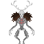
 
<blockquote>“A gaunt, towering figure of hunger and winter. Run while you still can.”</blockquote>
<b>Threat Level:</b> Very High 
<b>Visual Description:</b> A massive, skeletal supernatural predator that materializes from the frost.
</td><td style="vertical-align: top;">

### Behavior & Mechanics
- **Tanky Juggernaut:** Boasts extremely high health (220) and devastating melee damage (30-45).
- **Relentless but Slow:** While it is a persistent hunter, its movement is significantly slower than a sprinting human.
- **Bone-Cracker:** Capable of mauling targets and biting off limbs.

### Survival Strategy
Distance is your only friend. Use ranged weapons and stay mobile. Because it is slow, you can outrun it, but do not let it corner you in a confined space.
</td></tr></table>

<h2 id="lightseeker">Lightseeker</h2>
<table><tr><td width="40%" style="vertical-align: top;">

 
<blockquote>“A wretched, eyeless thing that moves with nauseating speed. It hunts light, so stay in the dark!”</blockquote>
<b>Threat Level:</b> High 
<b>Visual Description:</b> A twitching, eldritch horror that slinks through the darkness.
</td><td style="vertical-align: top;">

### Behavior & Mechanics
- **Phototaxis:** It specifically targets any mob carrying an active light source (flashlights in hands, on belts, or ID slots).
- **Blinding Speed:** One of the fastest entities in the game; if it sees a light, it will close the gap almost instantly.
- **Proximity Aggression:** While it hunts light, it will still attack anyone it "bumps" into (within 1 tile).

### Survival Strategy
If you hear the wet clicking of a Lightseeker, turn off your flashlight immediately and move away from your last position. If you are coated in Phosphor dye, you are a walking beacon and must find a secure room.
</td></tr></table>

<h2 id="alien-xenomorph">Alien Xenomorph</h2>
<table><tr><td width="40%" style="vertical-align: top;">

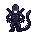
 
<blockquote>“A sleek, chitinous nightmare. Acidic blood, razor claws, and absolutely no mercy.”</blockquote>
<b>Threat Level:</b> Extreme (Apex Predator) 
<b>Visual Description:</b> A terrifying, multi-limbed extraterrestrial with a signature elongated head and sharp tail.
</td><td style="vertical-align: top;">

### Behavior & Mechanics
- **The Perfect Organism:** High health, high damage, and fast movement.
- **Drone Subtype:** You may encounter "Drones," which are smaller and more fragile (90 HP) but move even faster than the standard Xenomorph.
- **Structural Damage:** These creatures can tear through structures with ease.

### Survival Strategy
Do not attempt to engage a Xenomorph alone. Use high-caliber weaponry and fire. If you see acid blood pooling on the floor, an Alien is nearby.
</td></tr></table>

<h2 id="fata-morgana">Fata Morgana</h2>
<table><tr><td width="40%" style="vertical-align: top;">

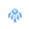
 
<blockquote>“The cold doesn’t just freeze the flesh; it rots the mind. When the whiteout takes your sight, do not trust the items in the distance.”</blockquote>
<b>Threat Level:</b> Medium (Psychological) 
<b>Visual Description:</b> A shifting silhouette born of ice that mimics the appearance of a supply crate or wooden planks.
</td><td style="vertical-align: top;">

### Behavior & Mechanics
- **Blizzard Trigger:** Appears to players who have spent too long in a blizzard.
- **The Disguise:** It appears as helpful loot (a crate or wood) at the edge of vision and moves away when you try to approach it.
- **The Deep Freeze:** If you manage to touch it, it vanishes in a burst of wind. This set your body temperature to 100K and disables your cold protection for 2 minutes, leading to rapid death if you aren't near a heater.

### Survival Strategy
If loot in the middle of a storm seems to "step" away from you as you walk toward it, it is a mirage. Stop chasing it and return to your shelter immediately.
</td></tr></table>

<h2 id="boreas">Boreas</h2>
<table><tr><td width="40%" style="vertical-align: top;">

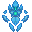
 
<blockquote>“A mountain of glacial ice, driven by a mindless hunger for the only thing we have left: warmth.”</blockquote>
<b>Threat Level:</b> High (Structural/Survival Threat) 
<b>Visual Description:</b> A massive elemental of dark blue glacial ice.
</td><td style="vertical-align: top;">

### Behavior & Mechanics
- **Human Neutrality:** The Boreas ignores people entirely. It does not care about you; it only cares about your fire.
- **Heat Vacuum:** It is drawn to active ovens and fireplaces. It can detect them from a distance and will pathfind toward them.
- **Door Breaker:** It will automatically open doors by "bumping" them or standing near them to reach indoor heat sources.
- **Fire Extinguisher:** Once near a fire, it "vacuums" the fuel, rapidly extinguishing the flames.
- **Glacial Armor:** Completely immune to brute force (punches/tools) and ballistic projectiles (bullets). It can only be harmed by BURN damage.

### Survival Strategy
You cannot shoot a Boreas. You must use fire (torches or fire-based weapons) to kill it. Since it ignores you, you can safely attack it, but you must do so quickly before it drains your colony's fuel and leaves you to freeze.
</td></tr></table>

<h2 id="echofiend">Echofiend</h2>
<table><tr><td width="40%" style="vertical-align: top;">

 
<blockquote>“The Lightseeker wants your eyes; the Echofiend wants your voice.”</blockquote>
<b>Threat Level:</b> High 
<b>Visual Description:</b> A blind, hunched monstrosity with massive ears.
</td><td style="vertical-align: top;">

### Behavior & Mechanics
- **Aural Tracking:** Completely blind. It reacts to speech, radio usage, and loud noises.
- **Investigation:** When it hears a sound, it will move to investigate that specific location.
- **Melee Combat:** If it gets within range 1 of a human, it will stop investigating and begin mauling them.

### Survival Strategy
Silence is mandatory. If an Echofiend is in the area, stop talking and stop using the radio. If you must move, do not run.
</td></tr></table>

<h2 id="canopy-strangler">Canopy Strangler</h2>
<table><tr><td width="40%" style="vertical-align: top;">

 
<blockquote>“Look up, or you might find your next breath cut short.”</blockquote>
<b>Threat Level:</b> High (Team-reliant) 
<b>Visual Description:</b> A vertical vine hanging from jungle trees.
</td><td style="vertical-align: top;">

### Behavior & Mechanics
- **Invisibility in Shadows:** It is virtually invisible (alpha 0) in the dark, becoming visible only when a light is shined on it or it has caught a victim.
- **Ambush:** When a human crosses its tile in the dark, it hoists them up, paralyzing and silencing them.
- **Suffocation:** Deals 5 BURN damage to the head every tick while strangling.

### Survival Strategy
Use a flashlight to scout the trees. If a teammate is hoisted, you must kill the vine or damage it enough to force a release.
</td></tr></table>

<h2 id="phosphor-beetle">Phosphor Beetle</h2>
<table><tr><td width="40%" style="vertical-align: top;">

 
<blockquote>“A glowing bug seems harmless, until its dye turns you into a beacon.”</blockquote>
<b>Threat Level:</b> Low (Enabler) 
<b>Visual Description:</b> A skittering beetle glowing with a green luminescence.
</td><td style="vertical-align: top;">

### Behavior & Mechanics
- **Dye Explosion:** If stepped on or attacked, it explodes into glowing green dye.
- **The Beacon:** The dye coats the human for 2 minutes, causing them to emit light and dealing 5 BURN damage to the chest.
- **Lightseeker Magnet:** The green glow makes you a priority target for Lightseekers, even if your flashlight is off.

### Survival Strategy
Kill them from a distance. If you are coated in green dye, stay away from unlit areas where Lightseekers might be lurking.
</td></tr></table>

<h2 id="mirelurk">Mirelurk</h2>
<table><tr><td width="40%" style="vertical-align: top;">

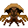
 
<blockquote>“Looks like a huge crab. Do not let those claws get near your limbs.”</blockquote>
<b>Threat Level:</b> Very High (Tank) 
<b>Visual Description:</b> A massive, heavily armored crustacean with thick chitinous plating.
</td><td style="vertical-align: top;">

### Behavior & Mechanics
- **Apex Durability:** Boasts an incredible health pool (2000), making it one of the hardest non-boss entities to kill.
- **Limb-Snapper:** Its powerful claws are capable of biting limbs clean off.
- **Predatory Instinct:** A dedicated carnivore that will relentlessly pursue prey once aggroed.

### Survival Strategy
Do not attempt to melee a Mirelurk unless you have heavy armor and support. Use high-penetration ranged weapons and exploit its relatively slow movement speed (delay 12).
</td></tr></table>

<h2 id="tyrannosaurus-rex">Tyrannosaurus Rex</h2>
<table><tr><td width="40%" style="vertical-align: top;">

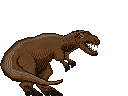
 
<blockquote>“A gargantuan carnivorous dinosaur of spine chillingly terrible majesty. The monarch of the prehistoric world.”</blockquote>
<b>Threat Level:</b> Catastrophic (Apex Predator) 
<b>Visual Description:</b> A towering, bipedal carnivore with a massive skull and bone-crushing jaws.
</td><td style="vertical-align: top;">

### Behavior & Mechanics
- **Siege Beast:** Capable of smashing through structures and walls with its sheer bulk.
- **One-Hit Lethality:** Melee damage (75-88) can instantly down or kill most unarmored humans.
- **Massive Vitality:** Features a very high health pool (1200).
- **Terrifying Reach:** Due to its huge size, it can strike from further away than standard mobs.

### Survival Strategy
Run. If you must fight, use anti-tank weaponry or artillery. Traditional firearms are inefficient against its massive health. Avoid being cornered in buildings, as it will simply knock them down.
</td></tr></table>

<h2 id="velociraptor">Velociraptor</h2>
<table><tr><td width="40%" style="vertical-align: top;">

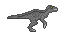
 
<blockquote>“Yep. You are fucked.”</blockquote>
<b>Threat Level:</b> Extreme 
<b>Visual Description:</b> A sleek, feathered predator that moves with terrifying grace and speed.
</td><td style="vertical-align: top;">

### Behavior & Mechanics
- **Blinding Speed:** One of the fastest land predators (delay 3), making escape on foot nearly impossible.
- **Lethal Precision:** High damage output (35-40) and capable of dismembering targets.
- **Aggressive Hunter:** Highly hostile behavior; it will attack on sight.

### Survival Strategy
Never travel alone in Raptor territory. Use group fire to take it down before it closes the distance. Its health (140) is moderate, so concentrated fire can kill it quickly if you spot it first.
</td></tr></table>

<h2 id="dimetrodon">Dimetrodon</h2>
<table><tr><td width="40%" style="vertical-align: top;">

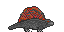
 
<blockquote>“A large predatory reptile, very deadly and very hungry.”</blockquote>
<b>Threat Level:</b> High 
<b>Visual Description:</b> A low-slung predatory reptile featuring a prominent neural sail on its back.
</td><td style="vertical-align: top;">

### Behavior & Mechanics
- **Hard Hitter:** Delivers massive melee damage (45-50), capable of breaking bones and tearing flesh with ease.
- **Resilient Hunter:** Significantly tankier than a raptor (240 HP).
- **Limbs at Risk:** Can bite off limbs if it sustains an attack on a survivor.

### Survival Strategy
Keep your distance. The Dimetrodon is fast (delay 3) and hits like a truck. Kite it using ranged weapons and avoid letting it get into melee range at all costs.
</td></tr></table>

<h2 id="pachycephalosaurus">Pachycephalosaurus</h2>
<table><tr><td width="40%" style="vertical-align: top;">

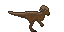
 
<blockquote>“Pachy for short. Hard-headed in more ways than one.”</blockquote>
<b>Threat Level:</b> High 
<b>Visual Description:</b> A bipedal dinosaur with a thick, bony dome on its head.
</td><td style="vertical-align: top;">

### Behavior & Mechanics
- **Battering Ram:** Uses its reinforced skull to deliver powerful bludgeoning attacks (30-35 damage).
- **Sturdy Build:** Possesses 120 health and can take a decent amount of punishment before falling.

### Survival Strategy
Avoid standing in a straight line with the Pachy. Use terrain to block its path and whittle down its health from a distance.
</td></tr></table>

<h2 id="compsognathus">Compsognathus</h2>
<table><tr><td width="40%" style="vertical-align: top;">

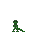
 
<blockquote>“Deadly in numbers...”</blockquote>
<b>Threat Level:</b> Medium (Swarm Threat) 
<b>Visual Description:</b> A tiny, bird-like dinosaur that moves in quick, jittery bursts.
</td><td style="vertical-align: top;">

### Behavior & Mechanics
- **Swarm Tactics:** While small (40 HP), their speed (delay 2) and tendency to appear in groups make them a dangerous nuisance.
- **Nipping Attacker:** Fast attacks that can quickly stack up damage if multiple 'Compys' surround a survivor.

### Survival Strategy
Use fast-firing weapons or wide-swinging melee tools to clear them out. They are fragile, but their small size and high speed make them difficult to hit.
</td></tr></table>

<h2 id="troll">Troll</h2>
<table><tr><td width="40%" style="vertical-align: top;">

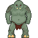
 
<blockquote>“Huge green troll. Strong, mean, and smells terrible.”</blockquote>
<b>Threat Level:</b> High 
<b>Visual Description:</b> A large, green-skinned humanoid with immense physical strength.
</td><td style="vertical-align: top;">

### Behavior & Mechanics
- **Brute Force:** Relies on high melee damage (35-40) to crush opponents.
- **Night Vision:** Can see clearly in the dark (8 tiles), making them dangerous nocturnal hunters.
- **Resilient:** Sturdy health pool (140) allows it to close the gap against standard firearms.

### Survival Strategy
Use fire if possible, or high-caliber rounds. Because they are large targets, they are easy to hit, but their ability to see in the dark means they often get the jump on unprepared survivors.
</td></tr></table>

<h2 id="mimic">Mimic</h2>
<table><tr><td width="40%" style="vertical-align: top;">

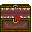
 
<blockquote>“That's no treasure chest!”</blockquote>
<b>Threat Level:</b> High (Ambush) 
<b>Visual Description:</b> Indistinguishable from a standard treasure chest while idle.
</td><td style="vertical-align: top;">

### Behavior & Mechanics
- **Ambush Specialist:** Remains perfectly still until a survivor attempts to interact with it.
- **Vicious Bite:** Once activated, it deals consistent melee damage (15-25) and moves at a moderate pace (delay 5).
- **Post-Mortem Bounty:** Upon death, the Mimic leaves behind a genuine loot treasure chest.

### Survival Strategy
Approach unknown chests with caution. If a chest seems out of place or you are in a high-risk area, hit it with a ranged weapon first to force its true form.
</td></tr></table>

<h2 id="giant-ground-sloth">Giant Ground Sloth</h2>
<table><tr><td width="40%" style="vertical-align: top;">

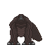
 
<blockquote>“A very slow and peaceful giant, unless you poke it with a stick.”</blockquote>
<b>Threat Level:</b> Low (Reactive) 
<b>Visual Description:</b> A massive, shaggy-furred prehistoric mammal.
</td><td style="vertical-align: top;">

### Behavior & Mechanics
- **Massive Bulk:** Possesses a very large health pool (550).
- **Peaceful Behemoth:** Generally non-hostile unless provoked. It will only defend itself when attacked.
- **Lumbering Pace:** Extremely slow movement speed (delay 15).

### Survival Strategy
Avoid attacking these giants unless you have the means to deal with their significant durability. Because they are so slow, they are easily kited if you accidentally provoke one.
</td></tr></table>

<h2 id="sabertooth">Sabertooth</h2>
<table><tr><td width="40%" style="vertical-align: top;">

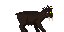
 
<blockquote>“A prehistoric mammal with a distinctive pair of long razor-sharp canine teeth. Don't get caught by one.”</blockquote>
<b>Threat Level:</b> High 
<b>Visual Description:</b> A powerful feline predator with signature elongated fangs. Variants exist in both brown and white fur.
</td><td style="vertical-align: top;">

### Behavior & Mechanics
- **Apex Hunter:** Naturally hostile and aggressive; it will chase down survivors with high speed (delay 3).
- **Bone-Crushing Jaws:** Deals significant melee damage (22-44), capable of quickly downing unarmored targets.
- **Nocturnal Predator:** Can see clearly in low-light conditions (6 tiles).

### Survival Strategy
Listen for their roars. Keep your distance and use ranged weapons. Their health (75) is relatively low, making them glass cannons that can be dispatched quickly if you have the initiative.
</td></tr></table>