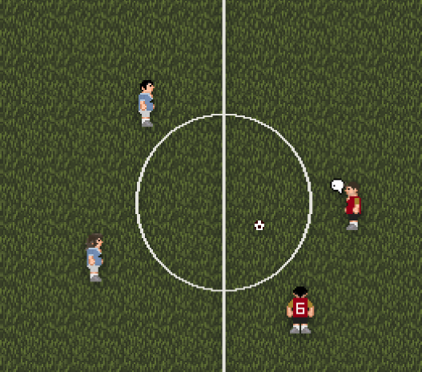

# Football

Yes, you can play football (or "soccer" if you're murrican) in Civ13!

</img>

## Controls:
You should have Hotkeymode enabled.
### With the ball:

- Mouse Click or Z to kick towards the mouse

- C to pass to nearest teammate

### Without the ball:

- Z to tackle (both you and your opponent get thrown on the ground) - Unless youre a goalkeeper, then Z picks up the ball.

- Mouse Click to put pressure on someone (might get the ball, lower chance than tackle but wont throw you or the opponent to the ground and you'll get the ball in your possession)

- C to put pressure on the nearest opponent

### Goalkeepers
- Goalkeepers can pick up the ball while in the goal area. If they move out of the area with the ball in their hands, it will be automatically dropped.