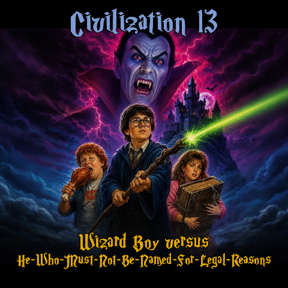

# Wizard Boy (Llanboarwart Academy of Magical Education)

```admonish tip
This is the full guide to the gamemode. For a quick start guide for those with short attention spans, visit **[the quickstart guide](wizard_boy_quickstart.md)**.
```

</img>

```admonish quote
*“You're a sorcerer, Barry!” - Hagrag*
```

---

## Introduction

Dust off your plastic glasses, tape up your wands, and prepare your magic sticks! We are taking you straight to the wettest, draftiest, most tragically underfunded school in the British Isles: **Llanboarwart Academy of Magical Education (L.A.M.E.)!** 

Forget those fancy, high-budget Scottish castles; you are not posh enough to be accepted into them anyway. We are heading to the rain-slicked Wales for a low-budget wizarding adventure in the valley of *Cwm-Tlawd*. Will you represent the brave, rowdy rugby players of **Rubywyrm**, the sneaky, leek-scented **Mintysnek**, the permanently depressed bookworms of **Slatepie**, or the friendly sheep-farmers of **Mustardweasel**? Grab your flying mop and prepare to defend your house in a high-stakes match of **Mop Ball**!

Take on the role of **Barry Hatter**, **Don Measly**, or **Harmonica Ranger** as you dodge the wrath of the greasy Professor Snip, avoid the screaming clutches of the Shrieking Shrub, and try not to turn your roommate into a wooden barrel. Master a *(legally-distinct)* grimoire of physics-based combat magic, from the simple *Zappus!* spark and the defensive *Blockum!* shield, to the devastating, highly forbidden *Deadum!* green laser.

---

## The Four Houses of Llanboarwart

Upon arrival at the academy, players are sorted in-game into one of four distinct, highly competitive houses:

### 🔴 Rubywyrm
</img>

*   **House Master:** **Madame McGronk** (Teaches *Things-into-Other-Things* and *Mop Ball*)
*   **The Vibe:** Stern, athletic, and hotheaded.
*   **In-Game Description:** 
    Rubywyrm students are known for their reckless courage, their pride in the legendary red dragon (*Y Ddraig Goch*), and their tendency to resolve magical disputes with a swift punch to the nose. While they aren't the best at studying, they are the first to charge into danger, usually without a plan. If your idea of "tactical magic" is shooting an explosive blast at point-blank range, this is your home.

### 🟢 Mintysnek
</img>

*   **House Master:** **Professor Snip** (Teaches *Cauldron-Stirring & Potion-Craft*)
*   **The Vibe:** Sneaky, ambitious, and slightly damp.
*   **In-Game Description:** 
    For the ambitious, the clever, and those who aren't above slipping a sleeping potion into the rival team's tea. Mintysnek students are masters of stealth, potion-brewing, and finding creative loopholes in the school handbook. They may smell faintly of leeks, but their ambition is as sharp as a rusted dagger. If you believe rules are merely suggestions, you will find your kin here.

### 🔵 Slatepie
</img>

*   **House Master:** **Professor Flickum** (Teaches *Spell-Waving & The History of Stuff*)
*   **The Vibe:** Highly intellectual, cynical, and kleptomaniacal.
*   **In-Game Description:** 
    Slatepie students possess sharp minds, a deep love of academic theory, and a natural instinct to pocket anything left unattended on a desk. They spend most of their time in the damp library researching spells to make their chores do themselves. If you are highly intelligent, slightly pessimistic, and have a collection of "borrowed" wands in your locker, Slatepie awaits.

### 🟡 Mustardweasel
</img>

*   **House Master:** **Madame Shrub** (Teaches *Plants, Beasts, & Mud-Digging*)
*   **The Vibe:** Friendly, down-to-earth, and chaotic.
*   **In-Game Description:** 
    Mustardweasels are a tight-knit bunch of farmers, creature-breeders, and lovable eccentrics who value loyalty, hard work, and wearing daffodils behind their ears. While they might not have the highest test scores, they are remarkably resilient and make the best herbal tea in the valleys. Come for the community, stay because a ferret stole your shoes.

---

# 🎓 L.A.M.E. Curriculum & Status Classifications

At **Llanboarwart Academy of Magical Education (L.A.M.E.)**, your academic standing dictates exactly what spells you are legally permitted to cast, what gear you can use, and how the school administration treats you. Players begin their journey as raw recruits and must earn their way up the academic ladder—or face disciplinary demotion.

---

## 🚫 Non-Academic & Disciplinary Tiers

These classifications are for students who have either failed entirely, have no magical aptitude, or have been stripped of their student rights due to misconduct.

### Tier 0: The I.D.I.O.T. Certificate
*(Inept & Deficient Individual’s Ordinary Test)*
*   **Skill Level Required:** 0 (and failing)
*   **The Lore:** The absolute lowest legal designation at the Academy. Players with this certificate are deemed medically and magically incompetent.
*   **Permitted Spells:** **NONE.** 

❌ Not allowed to use wands.

❌ Not allowed to drive flying mops.

### Disciplinary Tier: The L.O.S.E.R. Status
*(Llanboarwart Outcast & Sub-standard Educational Reject)*
*   **Skill Level Range:** Any (Locked upon receiving the status)
*   **The Lore:** A punitive status applied to players who violate school laws (e.g., casting dark magic, attacking teachers, or dropping their House Points below -100). 
*   **Permitted Spells:** 
    *   `Blockum!` (10) — *For self-defense only.*
    *   `Cleanum!` (Utility) — *To perform community service.*
    *   *System Restraints:* All offensive, force, and elemental spells are instantly locked out.
*   **Social Restrictions:** Stripped of their house robes and forced to wear a generic pink robe. Considered fair game to use spells against.

❌ Not allowed to drive flying mops.

---

## 📖 The L.A.M.E. Magic Curriculum

This is the standard progression for students residing in **Rubywyrm**, **Mintysnek**, **Slatepie**, and **Mustardweasel**.

### Tier 1: The U.N.G.A. Licence (Novice)
*(Underperforming Numpty General Assessment)*
*   **To Qualify:** You will need to assemble a wand. Look around the Cwm-Tlawd valley for parts, then visit the workshop.
*   **The Lore:** Designed for students who are better suited for physical labor in the coal mines or playing brute defense on the Mop Ball pitch.
*   **Permitted Spells:** 
    *   `Zappus!` (1) — *The basic spark.*
    *   `Lightus!` (5) — *The flashlight charm.*
    *   `Blockum!` (10) — *Reactive shield bubble.*

❌ Not allowed to use spells outside of the school's premises.

❌ Not allowed to drive flying mops.

### Tier 2: The C.O.A.L. Licence (Apprentice)
*(Cwm-Tlawd Ordinary Amateur Licence)*
*   **To Qualify:** You will need to brew the **Welsh Instant Darkness** potion and bring it to Professor Snip in the Main Hall.
*   **The Lore:** The bare minimum licence required to carry a wand in the Cwm-Tlawd valley without being arrested by the local constabulary. It focuses on basic self-defense and petty utility.
*   **Permitted Spells:** *All Tier 1 spells, plus:*
    *   `Dropus!` (15) — *Standard disarming beam.*
    *   `Stinkaeum!` (20) — *Standard biological hex.*

✅ Allowed to use spells outside of the school's premises.

❌ Not allowed to drive flying mops.

### Tier 3: The G.E.M. Licence (Experienced)
*(Gravity & Elemental Manipulation)*
*   **To Qualify:** You will need to pass the G.E.M. assessment in Classroom 1, defending yourself against the animated target.
*   **The Lore:** Granted to mid-years who have proven they won't accidentally collapse the school's slate roofs. This licence unlocks the physical manipulation of objects and the surrounding environment, and the use of flying mops.
*   **Permitted Spells:** *All Tier 1 & 2 spells, plus:*
    *   `Pushum!` (30) — *The physical, invisible shove.*
    *   `Pullus!` (30) — *Target/item retrieval.*
    *   `Wallus!` (35) — *Summons a physical wooden barricade.*
    *   `Floatus!` (40) — *Removes gravity and friction from a target.*

✅ Allowed to use spells outside of the school's premises.

✅ Allowed to drive flying mops.

### Tier 4: The B.A.S.E.D. Degree (Expert)
*(Boarwart Advanced Sorcery & Experimental Deeds)*
*   **To Qualify:** You will need to defeat one hostile wizard (like a moldy man).
*   **The Lore:** Students who achieve this rank are considered "extremely based" by their peers, though the faculty considers them highly unstable. These spells allow for heavy elemental destruction and high-speed movement.
*   **Permitted Spells:** *All Tier 1, 2 & 3 spells, plus:*
    *   `Freezum!` (50) — *Freezes a target inside a solid block of ice.*
    *   `Blinkae!` (55) — *Short-range line-of-sight teleportation.*
    *   <span style="color:red">`Burnus!`</span> (55) — *Fire-starting cone of flame.*
    *   `Barrelus!` (65) — *Transfigures a target into an explosive wooden barrel.*
    *   <span style="color:red">`Sliceum!`</span> (70) — *An invisible slashing beam that causes bleeding.*
    *   `Fixae!` (70) — *Advanced healing and structural repair.*

✅ Allowed to use spells outside of the school's premises.

✅ Allowed to drive flying mops.

### Tier 5: The C.H.A.D. Status (Master)
*(Classified High-level Arcane Destruction)*
*   **To Qualify:** You will need to defeat another student in the Arena.
*   **The Lore:** The absolute peak of magical education. You must be an absolute "gigachad" to cast these spells without your wand exploding or your head caving in from the sheer Juice cost.
*   **Permitted Spells:** *All Tier 1, 2, 3, & 4 spells, plus:*
    *   <span style="color:red">`Explodus!`</span> (80) — *Heavy explosive concussive bolt.*
    *   <span style="color:red">`Painum!`</span> (85) — *The excruciating torture curse (strictly illegal).*
    *   <span style="color:red">`Deadum!`</span> (100) — *The unblockable, instant-death green laser (strictly illegal).*

✅ Allowed to use spells outside of the school's premises.

✅ Allowed to drive flying mops.

---

## 🧙‍♂️ The Grimoire (Spells & Mechanics)

Spells are cast using the **100-Point "Juice" (Mana) Pool**, which regenerates at **5 points per second (50 ds)**.

```admonish danger
Spells marked in red are **illegal** to use against non-hostile mobs and will result on your demotion to L.O.S.E.R. status.
```

| Spell Name | Description | Cast Time | Juice Cost | Min Skill | Mechanical Effect |
| :--- | :--- | :--- | :--- | :--- | :--- |
| **Zappus!** | Standard light spark. | 5 ds (0.5s) | 5 | 1 | Fires a fast, low-damage kinetic projectile (5 brute). |
| **Blockum!** | A protective shield. | 0 ds | 15 | 10 | Creates a magic denial bubble around the caster. |
| **Lightus!** | Emits a temporary magical light from the caster. | 0 ds | 15 | 5 | Grants a temporary light source for the caster. |
| **Dropus!** | The disarming beam. | 5 ds (0.5s) | 15 | 15 | Forces the target to drop their held item. |
| **Stinkaeum!** | Standard biological hex. | 5 ds (0.5s) | 15 | 20 | Makes the target urinate and defecate. |
| **Pushum!** | A rude, invisible shove. | 7 ds (0.7s) | 20 | 30 | Pushes the target away, dealing impact damage if they hit a wall. |
| **Pullus!** | Pulls targets or items. | 7 ds (0.7s) | 20 | 30 | Pulls the target toward the caster, causing slam damage on obstacles. |
| **Wallus!** | Summons a sturdy wooden barricade at the target location. | 15 ds (1.5s) | 30 | 35 | Creates a magical barrier at the target tile if it is empty. |
| **Floatus!** | Removes the burden of gravity. | 12 ds (1.2s) | 35 | 40 | Applies near-zero friction and makes the target float. |
| **Freezum!** | Encases target in ice. | 15 ds (1.5s) | 35 | 50 | Freezes and paralyzes the target (5 burn, -120 temp). |
| **Blinkae!** | Teleports the caster to a nearby clicked location. | 15 ds (1.5s) | 30 | 55 | Teleports the caster to a nearby tile, if the path is clear. |
| <span style="color:red">**Burnus!**</span> | A reckless fire bolt. | 15 ds (1.5s) | 40 | 55 | Fires a flame bolt that ignites and burns targets. |
| **Barrelus!** | Polymorphs target. | 15 ds (1.5s) | 25 | 65 | Turns the target into a wooden barrel for a short time. |
| <span style="color:red">**Sliceum!**</span> | Invisible cutting strike. | 20 ds (2.0s) | 40 | 70 | Deals a sharp strike and inflicts bleeding. |
| **Fixae!** | A powerful healing spell that rejuvenates the target. | 15 ds (1.5s) | 50 | 70 | Heals and fully revives the target. |
| <span style="color:red">**Explodus!**</span> | Heavy explosive blast. | 30 ds (3.0s) | 60 | 80 | Launches a projectile that detonates in an area effect. |
| <span style="color:red">**Painum!**</span> | Torture curse. | 30 ds (3.0s) | 50 | 85 | Causes agony, stuns, and blurs vision. |
| <span style="color:red">**Deadum!**</span> | The green delete laser. | 50 ds (5.0s) | 100 | 100 | Charges and instantly gibbs the target on hit. |

---

### ⌨️ Spell Hotkeys (5-9)

You can bind up to **5 spells** to your number keys **5, 6, 7, 8, and 9** for quick casting.

To set them up, press **C** (the `secondary_attack_self()` key) while holding your wand. This will open a prompt asking you to choose which 5 spells from your grimoire you want to assign to those keys. Select your preferred spells and they'll be ready to cast at the tap of a number key.

---

## 🪄 Wand Parts, Effects & Assembly

Wands in *Wizard Boy* are modular. A functioning wand is assembled at a **wand assembly bench** from:

* **One wood chassis**
* **One core engine**
* **One length selection**

### Wand assembly process

1. Grab a wand part and click the **wand assembly bench** to place it.
2. Place one wood chassis and one core on the bench.
3. Choose the desired length: **Stubby**, **Standard**, **Overcomp**, or **Telescopic**.
4. Click **Assemble Wand** once both parts are present.
5. If needed, use **Eject** to remove and swap parts before assembling.

```admonish note
The bench requires one wand chassis and one wand core to assemble a wand.
```

### Wood chassis effects

* <dmi-sprite src="https://raw.githubusercontent.com/civ13/civ13/master/icons/obj/magic_items.dmi" state="pine_wood" dir="south" scale="2"></dmi-sprite> **Pine wood** – baseline; no modifier, but a small chance to splinter on overcast.
* **Rarity:** Common. Grab branches from trees and clear them.
---
* <dmi-sprite src="https://raw.githubusercontent.com/civ13/civ13/master/icons/obj/magic_items.dmi" state="mdf_board" dir="south" scale="2"></dmi-sprite> **MDF fibreboard** – -10% juice cost, but the wand can swell when wet and become unreliable.
* **Rarity:** Common. Found in villager's houses and from broken wood furniture.
---
* <dmi-sprite src="https://raw.githubusercontent.com/civ13/civ13/master/icons/obj/magic_items.dmi" state="balsa_wood" dir="south" scale="2"></dmi-sprite> **Balsa wood** – -40% cast time, +20% juice cost, no melee force, and the wand will snap if used as a melee weapon.
* **Rarity:** Uncommon. Found in shops and people's houses.
---
* <dmi-sprite src="https://raw.githubusercontent.com/civ13/civ13/master/icons/obj/magic_items.dmi" state="snooker_cue" dir="south" scale="2"></dmi-sprite> **Snooker cue** – +20% cast time, but grants strong melee force.
* **Rarity:** Uncommon. Found in pubs and game rooms.
---
* <dmi-sprite src="https://raw.githubusercontent.com/civ13/civ13/master/icons/obj/magic_items.dmi" state="fibreglass" dir="south" scale="2"></dmi-sprite> **Fibreglass** – -25% cast time, and the wand lashes the caster on overcast.
* **Rarity:** Uncommon. Found in factories and warehouses.
---
* <dmi-sprite src="https://raw.githubusercontent.com/civ13/civ13/master/icons/obj/magic_items.dmi" state="driftwood" dir="south" scale="2"></dmi-sprite> **Driftwood** – -20% elemental juice cost and emits a passive stink that lowers mood.
* **Rarity:** Uncommon. Found in beaches and riversides.
---
* <dmi-sprite src="https://raw.githubusercontent.com/civ13/civ13/master/icons/obj/magic_items.dmi" state="stale_chip" dir="south" scale="2"></dmi-sprite> **Stale Chip** – Healing spells (`Fixae!`) cast 30% faster. Gradually crumbles from non-healing casts (20% chance per cast to lose its speed bonus).
* **Rarity:** Rare. Can be found by the school canteen/kitchen.
---
* <dmi-sprite src="https://raw.githubusercontent.com/civ13/civ13/master/icons/obj/magic_items.dmi" state="shrub_root" dir="south" scale="2"></dmi-sprite> **Shrieking Shrub Root** – -20% cast time; projectile spells deal +50% damage. Every cast triggers an ear-splitting shriek, inflicting agony on all nearby mobs (including allies).
* **Rarity:** Premium / Quest only. Obtained from defeating Shrieking Shrubs.
---
* <dmi-sprite src="https://raw.githubusercontent.com/civ13/civ13/master/icons/obj/magic_items.dmi" state="cap_truncheon" dir="south" scale="2"></dmi-sprite> **C.A.P. Truncheon** – Good melee damage. Completely immune to `Dropus!` disarming. +20% cast time.
* **Rarity:** Premium / Quest only. Obtained from Ministry C.A.P. officers or the police station.

---

### Core engine effects

* <dmi-sprite src="https://raw.githubusercontent.com/civ13/civ13/master/icons/obj/magic_items.dmi" state="pigeon_feather" dir="south" scale="2"></dmi-sprite> **Pigeon feather** – movement spells cast near-instantly; low-HP panic can trigger an auto-blink.
* **Rarity:** Common. Found around pigeons and built areas.
---
* <dmi-sprite src="https://raw.githubusercontent.com/civ13/civ13/master/icons/obj/magic_items.dmi" state="pocket_lint" dir="south" scale="2"></dmi-sprite> **Pocket lint** – randomizes juice cost each cast.
* **Rarity:** Common. Found in common rooms and wherever people congregate.
---
* <dmi-sprite src="https://raw.githubusercontent.com/civ13/civ13/master/icons/obj/magic_items.dmi" state="rat_tail" dir="south" scale="2"></dmi-sprite> **Feral Rat Tail** – Projectile spells deal +15 bonus brute damage when hitting a target from behind (the target is facing away). When your own HP drops below 50%, misfire chance surges by 30%.
* **Rarity:** Common. Found in hidden corners of the school or the sewers.
---
* <dmi-sprite src="https://raw.githubusercontent.com/civ13/civ13/master/icons/obj/magic_items.dmi" state="copper_wire" dir="south" scale="2"></dmi-sprite> **Copper wire** – -25% all juice costs, but overcasting can become lethal.
* **Rarity:** Uncommon. Found in people's houses and broken machinery.
---
* <dmi-sprite src="https://raw.githubusercontent.com/civ13/civ13/master/icons/obj/magic_items.dmi" state="asbestos" dir="south" scale="2"></dmi-sprite> **Asbestos fibre** – fireproof while held, but applies passive toxin damage.
* **Rarity:** Uncommon. Found in old buildings.
---
* <dmi-sprite src="https://raw.githubusercontent.com/civ13/civ13/master/icons/obj/magic_items.dmi" state="sheep_wool" dir="south" scale="2"></dmi-sprite> **Damp Sheep Wool** – Juice regenerates **30% faster** while the wand is held. Casting `Burnus!` or `Explodus!` superheats the wet wool, scorching your lungs with steam (coughing, stamina drain, minor burn damage).
* **Rarity:** Uncommon. Found in the fields near sheep.
---
* <dmi-sprite src="https://raw.githubusercontent.com/civ13/civ13/master/icons/obj/magic_items.dmi" state="fox_fur" dir="south" scale="2"></dmi-sprite> **Fox fur** – silent casts with no sound/VFX, at the cost of +2 seconds of cast delay.
* **Rarity:** Rare. Found in the dark forest.
---
* <dmi-sprite src="https://raw.githubusercontent.com/civ13/civ13/master/icons/obj/magic_items.dmi" state="badger_hair" dir="south" scale="2"></dmi-sprite> **Badger hair** – combat spells are 20% faster; defensive spells cost 50% more.
* **Rarity:** Rare. Found in the dark forest.
---
* <dmi-sprite src="https://raw.githubusercontent.com/civ13/civ13/master/icons/obj/magic_items.dmi" state="chewing_gum" dir="south" scale="2"></dmi-sprite> **Used Chewing Gum** – Completely immune to `Dropus!` and physical disarming — the wand simply will not leave your hand. Manually unequipping or swapping hands takes a painful 3 seconds.
* **Rarity:** Rare. Found in some of school's desks.
---
* <dmi-sprite src="https://raw.githubusercontent.com/civ13/civ13/master/icons/obj/magic_items.dmi" state="cassette_tape" dir="south" scale="2"></dmi-sprite> **Tangled Cassette Tape** – Every spell cast has a 15% chance to fire a second identical projectile for free. 5% chance to **Jumble** — the wand ignores your selected spell and fires a random one from your grimoire instead.
* **Rarity:** Rare. Found in people's houses.
---
* <dmi-sprite src="https://raw.githubusercontent.com/civ13/civ13/master/icons/obj/magic_items.dmi" state="spark_plug" dir="south" scale="2"></dmi-sprite> **Rusted Spark Plug** – All spells cost **30% less juice**. Overcasting causes an immediate catastrophic backfire — shattering the bones in your hand (30 brute, fracture) and forcing a wand drop.
* **Rarity:** Premium / Quest only. Obtained from old vehicles.
---
* <dmi-sprite src="https://raw.githubusercontent.com/civ13/civ13/master/icons/obj/magic_items.dmi" state="gnat_wing" dir="south" scale="2"></dmi-sprite> **Golden Gnat Wing** – Casting time reduced to **50% of normal** (an effective 2× speed increase). Zero misfire. No overcast protection.
* **Rarity:** Premium / Quest only. Obtained by catching a golden gnat (rare spawning creature).
---
* <dmi-sprite src="https://raw.githubusercontent.com/civ13/civ13/master/icons/obj/magic_items.dmi" state="gloom_thread" dir="south" scale="2"></dmi-sprite> **Gloom-Weave Thread** – -50% juice cost on all spells. Projectile hits inflict **Frostbite** on targets (3-second movement slow, stamina drain). The permanent chill steadily leeches warmth from the caster's soul.
* **Rarity:** Premium / Quest only. Obtained from the Gloom creatures in the school's haunted basement or from dark wizard vendors.

---

### Length effects

* **Stubby** – tiny and fast-draw, but -2 tile range.
* **Standard** – balanced baseline.
* **Overcomp** – +3 tile range, -15% projectile spell juice cost, and the wand is too large for belt/pocket.
* **Telescopic** – collapsible; collapsed acts like Stubby, extended acts like Overcomp, and it has a chance to collapse on cast.

---

## 🔥 Teleporting Fireplaces

</img> Magical fireplaces enable you to quickly teleport around the map. Clicking a fireplace will teleport you to its linked destination, or even prompt you to choose one of available destinations. You need to have at least the **G.E.M. licence** to be able to use fireplaces.

The fireplaces on the Main Hall let you travel to dangerous zones in order to fight Moldy Men and find rare items - make sure to bring backup!

---

## 🎁 Contraband & Restoration Items

Because you cannot simply wait in corners to regenerate your Juice in the middle of a duel, look for these items scattered around the school grounds:

*   **Choco-Toads:** Eating one instantly restores **50 Juice**.
*   **I-Can't-Believe-It's-Not-Butter-Beer:** Restores **50 Juice**, but applies a 5-second blurred vision (dizzy) screen effect.
*   **Professor Snip's Green Goop:** A rare potion flask. Instantly restores **100 Juice** and completely fills Stamina, but causes minor toxin damage over time.