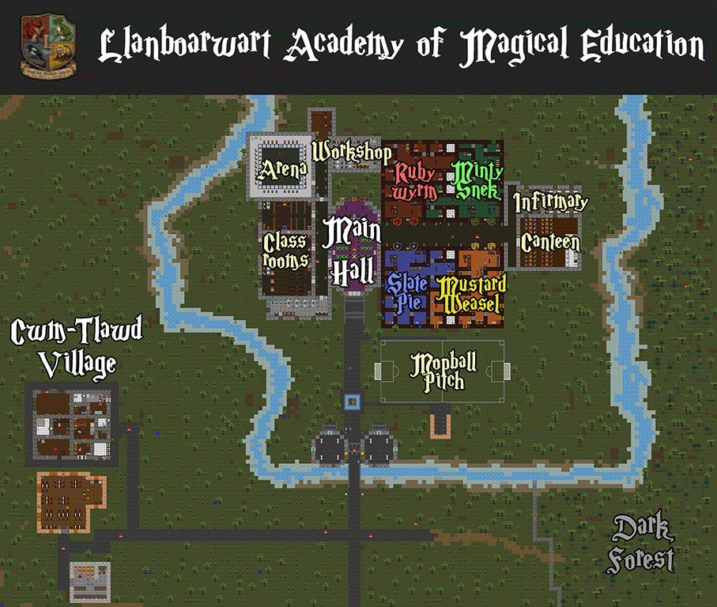

# Wizard Boy Quickstart Guide

```admonish tip
This is the short quickstart guide for new players. For the full wiki page, visit **[the Wizard Boy Guide](wizard_boy.md)**.
```

---

## Introduction

Welcome to **Llanboarwart Academy of Magical Education (L.A.M.E.)**, the wettest, draftiest, and most tragically underfunded wizarding school in the Welsh valleys!

</img

Upon entering the game, your first task is to get sorted into one of the four legendary, highly competitive houses by interacting with **The Placing Fedora**:

*   🔴 **Rubywyrm**: Athletic rugby players who are brave, hotheaded, and prefer resolving disputes with their fists.
*   🟢 **Mintysnek**: Sneaky, ambitious potion-brewing students who smell faintly of leeks and see rules as suggestions.
*   🔵 **Slatepie**: Intellectual, cynical bookworms who spend their time in the library and have a habit of pocketing unattended items.
*   🟡 **Mustardweasel**: Resilient, down-to-earth sheep farmers and creature-breeders who value loyalty and herbal tea.

You can choose to take the **5-question sorting test** or opt for **random assignment** to begin your magical student career.

---

## First Steps

### Starting as an I.D.I.O.T.
Every new student begins at qualification level 0: **I.D.I.O.T.** (*Inept & Deficient Individual’s Ordinary Test*). As an I.D.I.O.T., you:
*   ❌ Do not have the black house robes, but a grey one that signals your current status.
*   ❌ Are legally barred from holding a wand.
*   ❌ Cannot cast any spells.
*   ❌ Cannot ride flying mops.

### Assembling Your First Wand
To advance past your I.D.I.O.T. status, you must scavenge the academy grounds and the nearby village and forest for wand parts and assemble your first focus:
1.  **Find Parts**: Look around the school for components:
    *   **Wood Chassis**: Pine wood, MDF board, Balsa wood, Snooker cue, Fibreglass, or Driftwood.
    *   **Core Engine**: Badger hair, Pigeon feather, Copper wire, Pocket lint, Asbestos fibre, or Fox fur.
2.  **Locate a Bench**: Find a **wand assembly bench** somewhere in the academy.
3.  **Place Components**: With a component in your active hand, click the assembly bench to place it. You need exactly **one wood chassis** and **one core engine** on the bench.
4.  **Select Length**: Use the bench interface to choose your wand's length: **Stubby**, **Standard**, **Overcomp**, or **Telescopic**.
5.  **Assemble**: Click **Assemble Wand** in the interface to build your custom wand! You can also use **Eject** to swap out components.

### Becoming a U.N.G.A.
The moment you assemble your first wand, you are automatically promoted to qualification level 1: **U.N.G.A.** (*Underperforming Numpty General Assessment*).
*   🎉 You are awarded your house robe, wizard hat, and round glasses!
*   🪄 You are now permitted to carry a wand and cast Novice spells (`Zappus!`, `Lightus!`, and `Blockum!`).

---

## Casting Spells

### Spell Selection & UI
*   Use your wizard spell selector HUD at the top of the screen to choose your active spell. You can also use Z and C keys (hotkey mode enabled) to cycle through the available spells.
*   Hold your wand in your active hand, point your cursor at your target, and click to cast!

### Juice (Mana) Mechanics
*   Spells consume points from your **100-Point Juice Pool**.
*   Your Juice pool regenerates passively at a rate of **5 points per second**.
*   **Overcasting**: You can still cast spells even if you do not have enough Juice. However, doing so drives your Juice to 0 and triggers **Overcast Penalties** depending on your wand's components (e.g. getting splinters from Pine, arm lacerations from Fibreglass, or a painful shock and fire from Copper).
*   **Misfires**: Spells can fail to cast. Be careful with MDF wood wands—if you stand out in the Welsh rain, your MDF wand will swell, doubling cast times and adding a +20% misfire chance until it dries.

---

## Quick Rules

```admonish warning
Llanboarwart has strict disciplinary guidelines. Disobeying them will result in your swift demotion.
```

1.  **No Free-For-Alls**: Do not attack your fellow students outside the designated dueling arena or Mop Ball pitch.
2.  **Avoid Red Spells**: Spells highlighted in red in the grimoire (such as `Burnus!`, `Sliceum!`, `Explodus!`, `Painum!`, and `Deadum!`) are **illegal** to use against non-hostile targets.
3.  **The L.O.S.E.R. Penalty**: Attacking teachers, casting forbidden/illegal magic on innocent students, or letting your House Points drop below -100 will demote you to **L.O.S.E.R.** status (*Llanboarwart Outcast & Sub-standard Educational Reject*):
    *   Pink robes and a dunce cap are automatically equipped.
    *   All offensive spells and flying mops are locked out.
    *   You are restricted to `Blockum!` (self-defense) and `Cleanum!` (community service).
    *   **Crucially:** You are considered fair game for other students to target with magic!
