## What is this?

Civilization 13 (formerly 1713) is a free game based on Space Station 13 code and using the BYOND platform, which features several epochs of human history. (hence the name).

It features both Roleplay-oriented and Team-Deathmatch modes, with the main one being [Nomads](gamemodes/Civilizations_and_Nomads.md), in which you need to bring your civilization from the Stone Age to the Modern Age.

<b>To contribute, edit a page using the links on the top right. You will need a github account. For more information check the guide [here](Contributing_to_the_Wiki.md).</b>

<b>[Official TDM Server](byond://civ13.com:1714) | [Official RP/Nomads Server](byond://civ13.com:1715) | [Official Persistence Server](byond://valzargaming.com:1714) | [Discord](https://discord.gg/hBEtg4x) | [Github](https://github.com/Civ13/Civ13)</b>

## Getting started

 &nbsp; <b>Guides</b>

<li class="mainmenu-line">  <a href="New_Player_Guide.md" title="How to Play"><b>How to Play</b></a> </li>
  
<li class="mainmenu-line">  <a href="rules/Rules.md" title="Rules"><b>Rules</b></a> </li>

<li class="mainmenu-line"> <a href="gamemodes/Civilizations_and_Nomads.md" title="Civilizations and Nomads">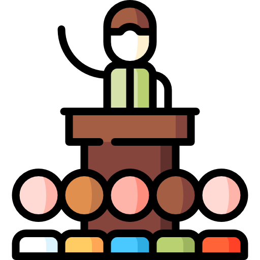</a> <a href="gamemodes/Civilizations_and_Nomads.md" title="Civilizations and Nomads"><b>Nomads</b></a> </li>

<li class="mainmenu-line">  <a href="Starter_Guide.md" title="Starter Guide"><b>Starter Guide</b></a> </li>

<li class="mainmenu-line">  <a href="guides/Guide_to_Character.md" title="Guide to Character"><b>Character</b></a> </li>

<li class="mainmenu-line"> <a href="guides/Guide_to_Races.md" title="Races">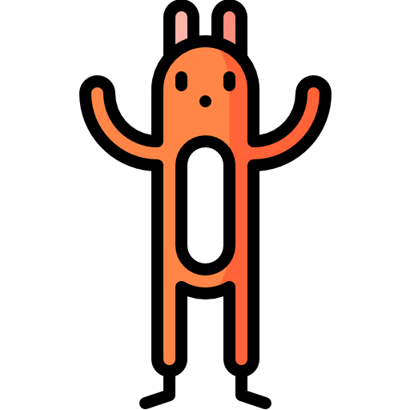</a> <a href="guides/Guide_to_Races.md" title="Guide to Races"><b>Races</b></a> </li>

<li class="mainmenu-line"> <a href="guides/Guide_to_Hygiene.md" title="Hygiene">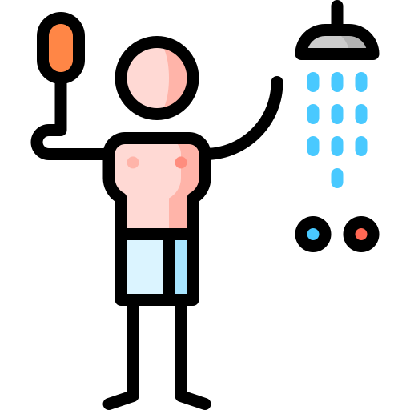</a> <a href="guides/Guide_to_Hygiene.md" title="Guide to Hygiene"><b>Hygiene</b></a> </li>

<li class="mainmenu-line"> <a href="guides/Guide_to_Crafting.md" title="Crafting">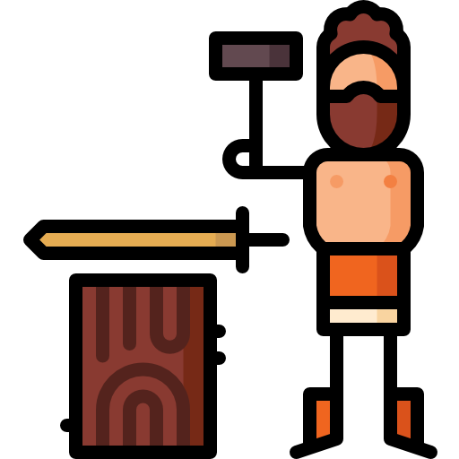</a> <a href="guides/Guide_to_Crafting.md" title="Guide to Crafting"><b>Crafting</b></a> </li>

<li class="mainmenu-line"> <a href="Full_Crafting_List.md" title="Full Crafting List">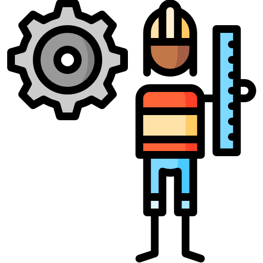</a> <a href="Full_Crafting_List.md" title="Full Crafting List"><b>Crafting List</b></a> </li>

<li class="mainmenu-line"> <a href="guides/Guide_to_Metallurgy.md" title="Metallurgy">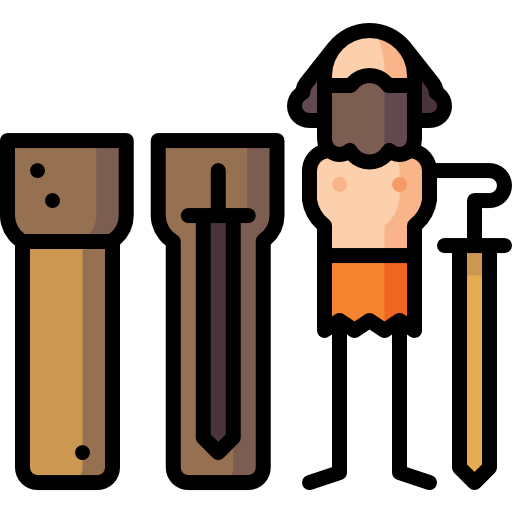</a> <a href="guides/Guide_to_Metallurgy.md" title="Guide to Metallurgy"><b>Metallurgy</b></a> </li>

<li class="mainmenu-line"> <a href="guides/Guide_to_Construction.md" title="Construction">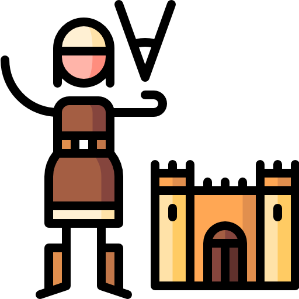</a> <a href="guides/Guide_to_Construction.md" title="Guide to Construction"><b>Construction</b></a> </li>

<li class="mainmenu-line">  <a href="guides/Guide_to_Communications.md" title="Guide to Communications"><b>Communication</b></a> </li>

<li class="mainmenu-line"> <a href="guides/Guide_to_Farming.md" title="Guide to Farming">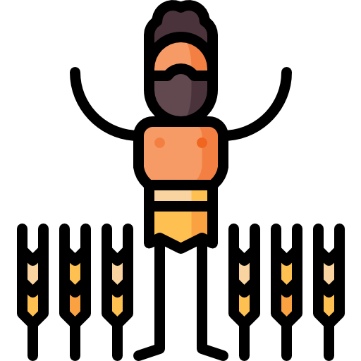</a> <a href="guides/Guide_to_Farming.md" title="Guide to Farming"><b>Farming</b></a> </li>

<li class="mainmenu-line"> <a href="guides/Guide_to_Ranching.md" title="Ranching">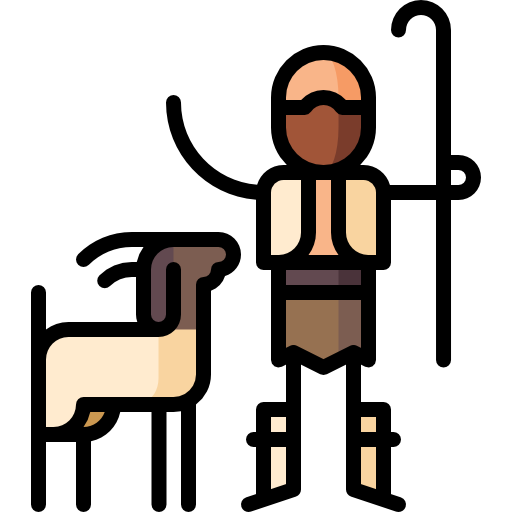</a> <a href="guides/Guide_to_Ranching.md" title="Guide to Ranching"><b>Ranching</b></a> </li>

<li class="mainmenu-line"> <a href="guides/Guide_to_Fishing.md" title="Fishing">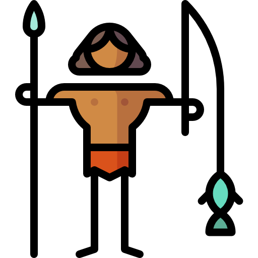</a> <a href="guides/Guide_to_Fishing.md" title="Guide to Fishing"><b>Fishing</b></a> </li>

<li class="mainmenu-line"> <a href="guides/Guide_to_Cooking.md" title="Cooking">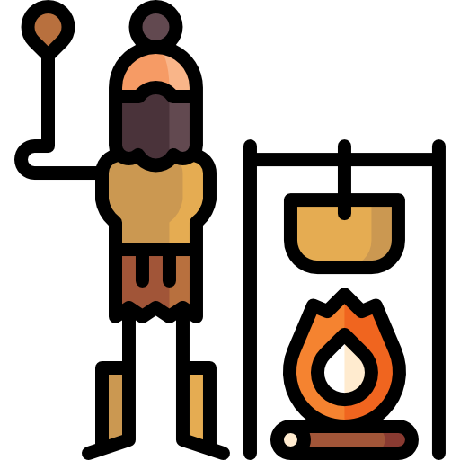</a> <a href="guides/Guide_to_Cooking.md" title="Guide to Cooking"><b>Cooking</b></a> </li>

<li class="mainmenu-line"> <a href="guides/Guide_to_Medical.md" title="Medical">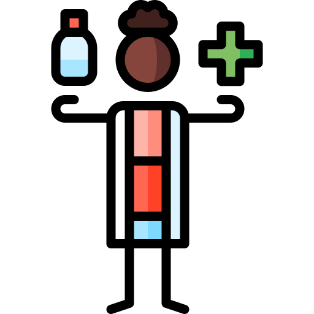</a> <a href="guides/Guide_to_Medical.md" title="Guide to Medical"><b>Medical</b></a> </li>

<li class="mainmenu-line"> <a href="guides/Guide_to_Chemistry.md" title="Chemistry">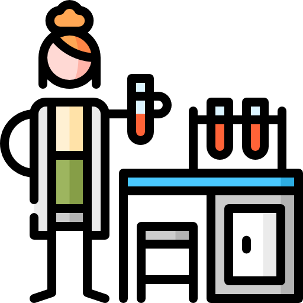</a> <a href="guides/Guide_to_Chemistry.md" title="Guide to Chemistry"><b>Chemistry</b></a> </li>

<li class="mainmenu-line"> <a href="guides/Guide_to_Radiation.md" title="Radiation">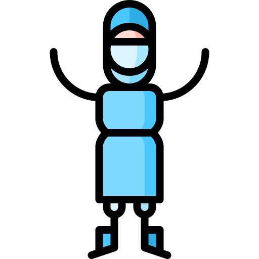</a> <a href="guides/Guide_to_Radiation.md" title="Guide to Radiation"><b>Radiation</b></a> </li>

<li class="mainmenu-line"> <a href="guides/Guide_to_Religion.md" title="Religion">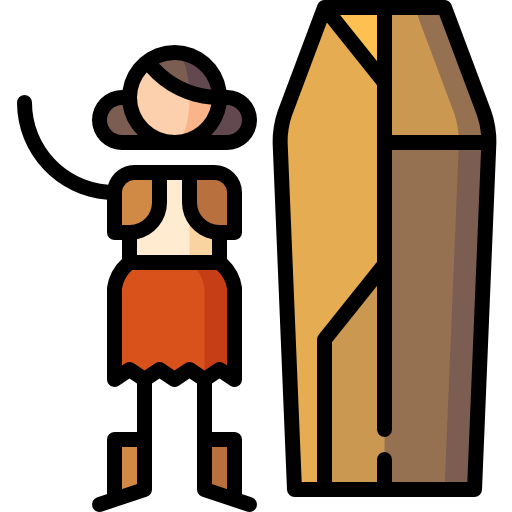</a> <a href="guides/Guide_to_Religion.md" title="Guide to Religion"><b>Religion</b></a> </li>

<li class="mainmenu-line"> <a href="guides/Guide_to_Paperwork.md" title="Paperwork">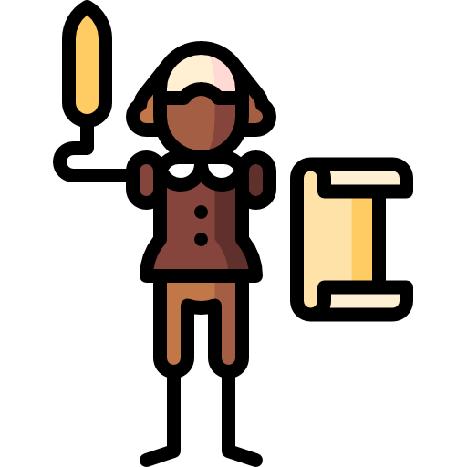</a> <a href="guides/Guide_to_Paperwork.md" title="Guide to Paperwork"><b>Paperwork</b></a> </li>

<li class="mainmenu-line"> <a href="guides/Guide_to_Weapons.md" title="Weapons">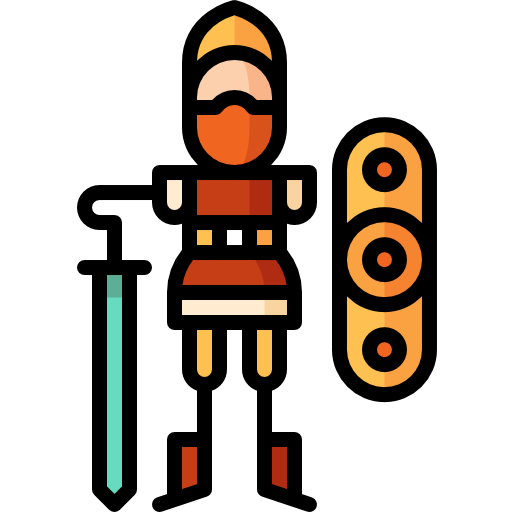</a> <a href="guides/Guide_to_Weapons.md" title="Guide to Weapons"><b>Weapons</b></a> </li>

<li class="mainmenu-line"> <a href="guides/Guide_to_Tanks.md" title="Tanks">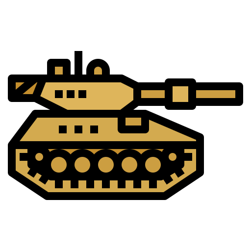</a> <a href="guides/Guide_to_Tanks.md" title="Guide to Tanks"><b>Tanks</b></a> </li>

 &nbsp; <b>Maps</b>

<table style="align-content:center;">
<tbody><tr>
<th style="align-content:center;"></th>
<th style="align-content:center;">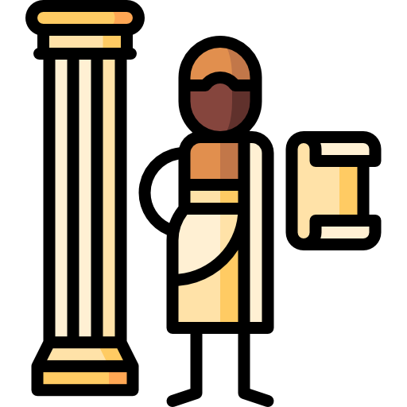</th>
<th style="align-content:center;">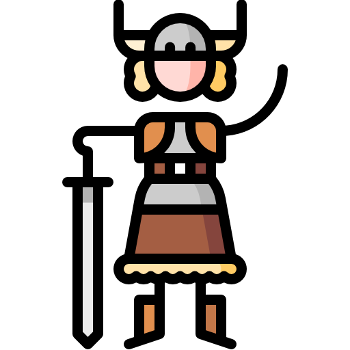</th></tr>
<tr style="text-align: center;">
<th style="align-content:center;">Scenarios</th>
<th style="align-content:center;">Bronze Age</th>
<th style="align-content:center;">Medieval Age</th></tr>
<tr>
<td style="vertical-align: top;">

<a href="Nomads_Maps.md">Nomads Maps</a> 

<a href="gamemodes/The_Art_of_the_Deal.md">Art of the Deal</a> 

<a href="maps/Pepelsibirsk.md">Pepelsibirsk</a> 

<a href="Wasteland.md">Wasteland</a> 

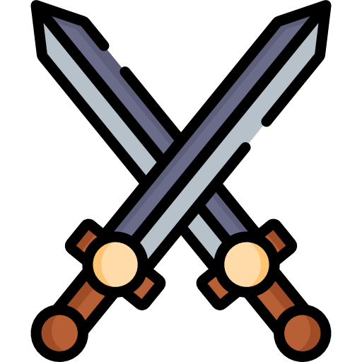<a href="Alleyway.md">Alleyway</a> 

<a href="maps/Tribes.md">Tribes</a> 
</td>
<td style="vertical-align: top;">

<a href="maps/Gladiators.md">Gladiators</a> 

<a href="Heraclea.md">Heraclea</a> 

<a href="maps/Siege.md">Siege</a> 

<a href="Teutoburg.md">Teutoburg</a> 

</td>
<td style="vertical-align: top;">

<a href="maps/Karak.md">Karak</a> 

<a href="maps/Camp.md">Camp</a> 

<a href="maps/Sammirhayeed.md">Sammir Hayeed</a> 

<a href="Battleroyale.md#Medieval">Battleroyale (Medieval)</a> 

<a href="Bohemia.md">Bohemia</a> 

</td>
</tr>
<tr>
<th style="align-content:center;">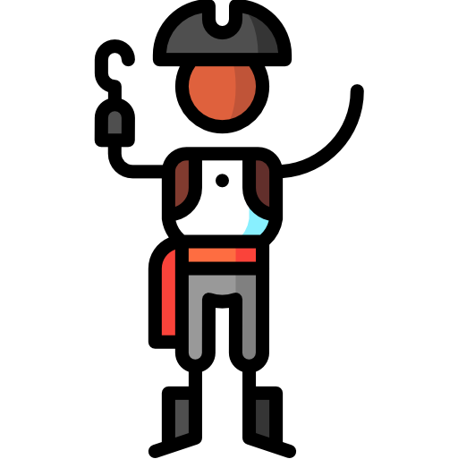</th>
<th style="align-content:center;">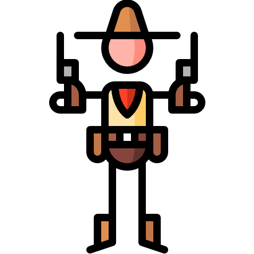</th>
<th style="align-content:center;">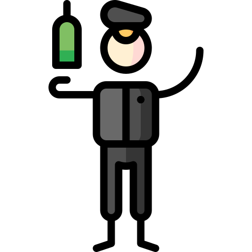</th></tr>
<tr style="text-align: center;">
<th style="align-content:center;">Imperial Age</th>
<th style="align-content:center;">Industrial Age</th>
<th style="align-content:center;">1st World War</th>
</tr>
<tr>
<td style="vertical-align: top;">

<a href="maps/Colony.md">Colony</a> 

<a href="Four_Colonies.md">Four Colonies</a> 

<a href="maps/Hunt.md">Hunt</a> 

<a href="maps/Naval.md">Naval</a> 

<a href="maps/Island.md">Island</a> 

<a href="Isla_Robusta.md">Isla Robusta</a> 

<a href="maps/Supply_Raid.md">Supply Raid</a> 

<a href="Fields.md">Fields</a> 

<a href="Recife.md">Recife</a> 

<a href="Battleroyale.md#Imperial">Battleroyale (Imperial)</a> 

</td>
<td style="vertical-align: top;">

<a href="maps/Little_Creek_RP.md">Little Creek (RP)</a> 

<a href="maps/Little_Creek_TDM.md">Little Creek (TDM)</a> 

<a href="Missionary_Ridge.md">Missionary Ridge</a> 

<a href="Pioneers.md">Pioneers</a> 
</td>
<td style="vertical-align: top;">

<a href="Ypres.md">Ypres</a> 

<a href="Hill_203.md">Hill 203</a> 

<a href="maps/Tsaritsyn.md">Tsaritsyn</a> 

<a href="Port_Arthur.md">Port Arthur</a> 

<a href="Santo_Tomas.md">Santo Tomas</a> 

<a href="Coloocan.md">Coloocan</a> 
</td>
</tr>
<tr>
<th style="align-content:center;">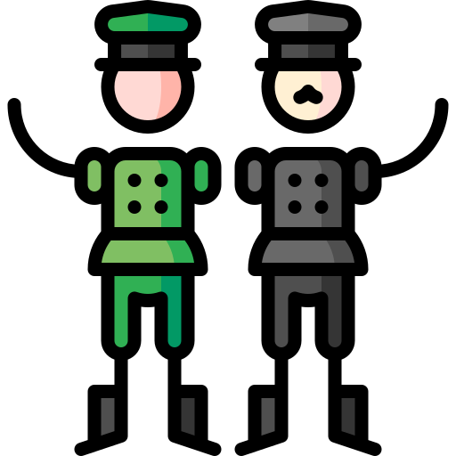</th>
<th style="align-content:center;"></th>
<th style="align-content:center;">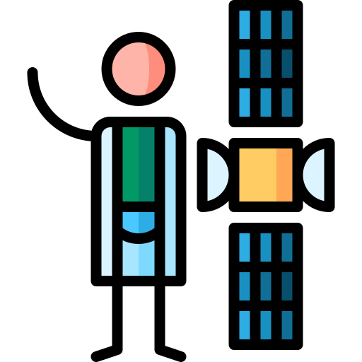</th></tr>
<tr style="text-align: center;">
<th style="align-content:center;">2nd World War</th>
<th style="align-content:center;">Cold War</th>
<th style="align-content:center;">Modern Age</th></tr>
<tr>

<td style="vertical-align: top;">

<a href="maps/Gulag_13.md">Gulag 13</a> 

<a href="Reichstag.md">Reichstag</a> 

<a href="Intramuros.md">Intramuros</a> 

<a href="Iwo_Jima.md">Iwo Jima</a> 

<a href="Khalkyn_Gol.md">Khalkyn Gol</a> 

<a href="Kursk.md">Kursk</a> 

<a href="Nanjing.md">Nanjing</a> 

<a href="Omaha.md">Omaha</a> 

<a href="Rizal_Stadium.md">Rizal Stadium</a> 

<a href="Stalingrad.md">Stalingrad</a> 

<a href="Stalingrad.md#Smallingrad">Smallingrad</a> 

<a href="Wake Island.md">Wake Island</a> 
</td>
<td style="vertical-align: top;">

<a href="Compound.md">Compound</a> 

<a href="Road_to_Dak_To.md">Road to Dak To</a> 

<a href="Retreat.md">Retreat</a> 

</td>
<td style="vertical-align: top;">

<a href="maps/Arab_Town.md">Arab Town</a> 

<a href="maps/Arab_Town.md#Arab_Town_II">Arab Town II</a> 

<a href="maps/Hostages.md">Hostages</a> 

<a href="Battleroyale.md#Modern">Battleroyale (Modern)</a> 
</td>
</tr>
</tbody></table>

## Other Things

[Contributing to this Wiki](Contributing_to_the_Wiki.md)

[Games](Games.md) (similar games and inspirations)
